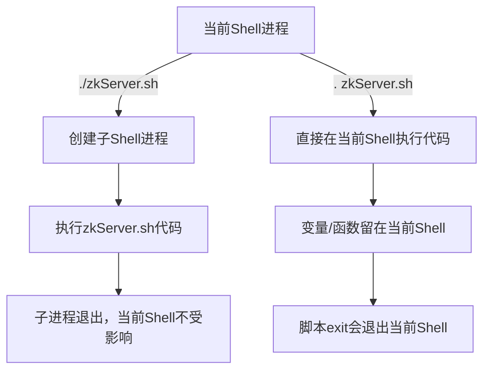

你想弄清楚 `./zkServer.sh` 和 `. zkServer.sh` 这两种执行方式的核心区别，本质是 Shell 中**“创建子进程执行脚本”** 和**“在当前进程执行脚本”** 的差异——这也是你之前启动 ZooKeeper 报错的关键原因之一。下面我会从执行原理、效果、适用场景三个维度拆解，让你彻底分清。

### 一、核心区别：执行进程（最关键）
先用一张表总结核心差异，再逐个解释：

| 执行方式       | 本质                | 进程环境       | 变量/函数影响       | 脚本退出行为       | 适用场景                |
|----------------|---------------------|----------------|---------------------|--------------------|-------------------------|
| `./zkServer.sh` | 作为可执行程序运行  | 启动**子 Shell** | 变量/函数仅在子进程生效，不污染当前 Shell | 脚本退出不影响当前 Shell | 执行独立程序（如启动/停止服务） |
| `. zkServer.sh` | `source zkServer.sh` 的简写 | 在**当前 Shell** 执行 | 变量/函数直接注入当前 Shell，可能冲突 | 脚本中 `exit` 会直接退出当前 Shell | 加载环境变量/函数到当前会话 |

### 二、逐点拆解（结合 ZooKeeper 脚本场景）
#### 1. `./zkServer.sh`：子进程执行（推荐用于启动 ZK）
- **执行原理**：  
  `./` 表示“当前目录下的可执行文件”，Shell 会**创建一个全新的子进程**来运行这个脚本，子进程有独立的环境变量、参数、工作目录。
- **对 ZK 的影响**：  
  ZooKeeper 的 `zkServer.sh` 是为“独立进程执行”设计的：
    - 脚本依赖 `$0` 定位自身路径（比如找 `../conf` 目录），子进程中 `$0` 就是 `./zkServer.sh`，路径解析正常；
    - 脚本中的变量（如 `ZOO_DATADIR`）、函数只在子进程中生效，执行完子进程退出，不影响你当前的 Shell 环境；
    - 脚本中的 `exit` 只会终止子进程，不会关掉你当前的终端。
- **示例**：
  ```bash
  # 正确：子进程启动 ZK，参数解析正常
  ./zkServer.sh start
  ```

#### 2. `. zkServer.sh`：当前进程执行（不适合启动 ZK）
- **执行原理**：  
  `.` 是 `source` 命令的简写，Shell 会**直接在当前会话的进程中执行脚本代码**，不创建子进程——相当于把脚本里的所有命令“复制粘贴”到当前终端执行。
- **对 ZK 的影响**（为什么会报错）：
    - **参数解析混乱**：当前进程中 `$0` 不是 `zkServer.sh`，而是你当前的 Shell（比如 `bash`），脚本里通过 `$0` 找配置目录的逻辑完全失效；
    - **环境污染**：脚本中的变量（如 `ZOOCFG`、`ZOO_DATADIR`）会直接留在你的当前 Shell 中，若后续执行其他命令，可能因变量冲突出问题；
    - **致命风险**：脚本中若有 `exit` 语句（比如配置解析失败时），会直接退出你当前的 Shell 终端（而非仅退出脚本）；
    - **参数传递异常**：你加的 `start /xxx/zoo.cfg` 会被当前 Shell 解析，而非脚本解析，导致参数识别错误。
- **示例**：
  ```bash
  # 错误：在当前进程执行，会导致 ZK 脚本参数解析失败、环境污染
  . zkServer.sh start /xxx/zoo.cfg
  ```

### 三、可视化对比（更直观）
用流程图展示两种执行方式的差异：


### 四、补充：什么时候用 `. 脚本.sh`？
`source`（`.`）并非没用，而是适用场景不同，比如：
- 加载环境变量：比如 `. /etc/profile`（把系统环境变量加载到当前终端）；
- 加载自定义函数：比如写了一个工具函数脚本，用 `source` 加载到当前会话，方便后续调用；
- 临时修改当前 Shell 环境：比如 `. ./set_env.sh`（临时切换 JDK 版本）。

**但绝对不适合用于执行像 `zkServer.sh` 这样的“独立服务启动脚本”**。

### 总结
1. **`./zkServer.sh`**：子进程执行，脚本独立运行，不影响当前 Shell，是启动/停止 ZK 的正确方式；
2. **`. zkServer.sh`**：当前进程执行，会污染环境、导致参数解析错误，甚至退出当前终端，完全不适合执行 ZK 启动脚本；
3. 核心原则：执行独立的服务脚本（如 ZK、Kafka、Tomcat 的启动脚本），一律用 `./脚本.sh` 或绝对路径（`/xxx/zkServer.sh`），避免用 `source/./.`。

如果之前因 `. zkServer.sh` 导致当前 Shell 环境有残留变量，可执行 `exec bash` 重启当前 Shell 清空环境，再用正确方式启动 ZK。