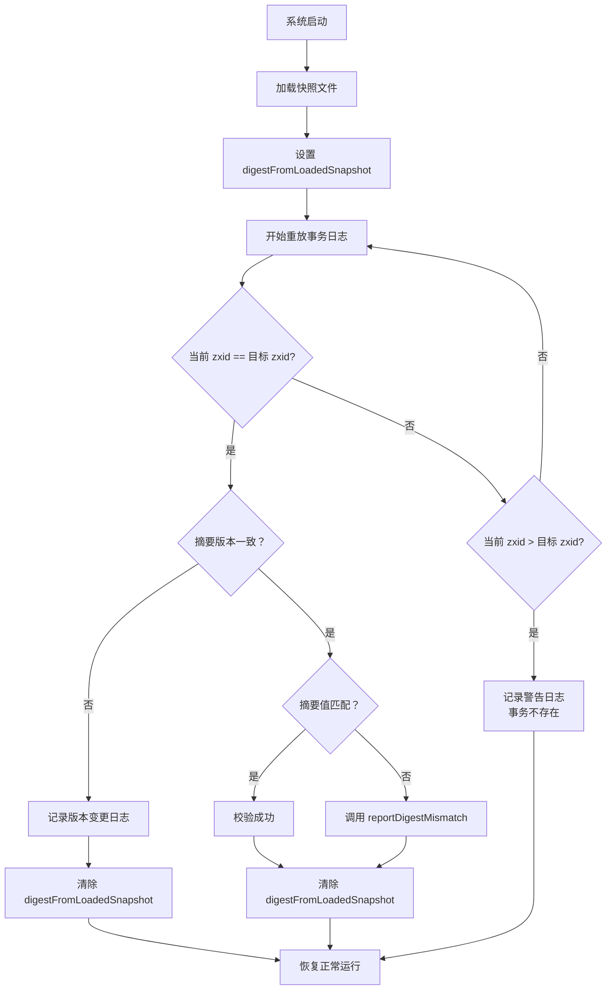

## `nodes` 和 `DataNode` 的场景区别与设计优势

### 📊 **核心区别**

| 维度 | `nodes` (NodeHashMap) | `DataNode` |
|------|----------------------|-----------|
| **职责** | **全局索引层** - 管理所有节点的路径映射和整棵树的 digest | **数据存储层** - 存储单个节点的具体数据 |
| **数据结构** | `ConcurrentHashMap<String, DataNode>` | 包含 `data[]`, `acl`, `stat`, `children` 等字段 |
| **作用域** | 整个数据树的宏观视角 | 单个节点的微观视角 |
| **核心功能** | 路径快速查找、增量哈希计算 | 数据存储、子节点管理、状态维护 |

---

### 🎯 **分开设计的好处**

#### 1️⃣ **职责分离（Separation of Concerns）**

```java
// nodes 负责：全局索引 + 整体 digest
private final NodeHashMap nodes;  // 本质是 Map<path, DataNode>
private final AdHash hash;        // 整棵树的增量哈希

// DataNode 负责：单个节点的数据存储
byte[] data;           // 节点数据
Long acl;              // ACL 引用
StatPersisted stat;    // 节点状态
Set<String> children;  // 子节点名称列表
```


**优势**：
- `nodes` 专注于**快速查找**和**一致性校验**
- `DataNode` 专注于**数据存储**和**树形结构维护**

---

#### 2️⃣ **性能优化**

**场景 1：快速路径查找（O(1) 复杂度）**
```java
// 通过 hashtable 直接定位节点，无需遍历树
DataNode node = nodes.get("/app/config");
```


**场景 2：增量 digest 更新（O(1) 复杂度）**
```java
// 当节点变化时，只需更新 AdHash，无需遍历整棵树
public void postChange(String path, DataNode node) {
    node.digestCached = false;
    addDigest(path, node);  // 只计算单个节点的 digest 并累加
}

// 获取整棵树的 digest
long getTreeDigest() {
    return hash.getHash();  // 直接返回 long 值
}
```


**对比**：如果不分开，每次计算整棵树 digest 需要 O(n) 遍历所有节点

---

#### 3️⃣ **序列化和反序列化优化**

从代码第 91-93 行的注释可以看到：
```java
/**
 * The tree maintains two parallel data structures: 
 * a hashtable that maps from full paths to DataNodes 
 * and a tree of DataNodes. 
 * All accesses to a path is through the hashtable. 
 * The tree is traversed only when serializing to disk.
 */
```


**读写分离策略**：
- **运行时访问**：通过 `nodes` 的 HashMap 快速访问（99% 的场景）
- **持久化时**：通过 `DataNode.children` 遍历树形结构（仅序列化时使用）

```java
// DataNode 中的 children 用于维护树形结构
public synchronized boolean addChild(String child) {
    if (children == null) {
        children = new HashSet<String>(8);
    }
    return children.add(child);
}

// 序列化时通过树形结构遍历
public void serialize(OutputArchive oa, String tag) throws IOException {
    // 通过 DataNode的 children 递归遍历整棵树
    // ...
}
```


---

#### 4️⃣ **并发安全性**

```java
// nodes 使用 ConcurrentHashMap 保证线程安全
private final ConcurrentHashMap<String, DataNode> nodes;

// DataNode 使用 synchronized 方法保证单个节点的线程安全
public synchronized boolean addChild(String child) {
    // ...
}

public synchronized byte[] getData() {
    return data;
}
```


**优势**：双层锁粒度控制
- 全局操作使用 `ConcurrentHashMap` 的细粒度锁
- 单节点操作使用 `synchronized` 方法锁

---

#### 5️⃣ **Digest 计算的层次化设计**

```java
// 第一层：DataNode 计算单个节点的 digest
class DataNode {
    private volatile long digest;  // 单个节点的 digest
    volatile boolean digestCached; // 缓存标记
}

// 第二层：NodeHashMap 维护整棵树的 digest
class NodeHashMapImpl {
    private final AdHash hash;  // 所有节点 digest 的累加和
    
    private void addDigest(String path, DataNode node) {
        hash.addDigest(digestCalculator.calculateDigest(path, node));
    }
}

// 第三层：DataTree 对外提供统一的 digest 接口
class DataTree {
    public long getTreeDigest() {
        return nodes.getDigest();  // 返回整棵树的 digest
    }
}
```


**优势**：
- 每层职责清晰
- 支持增量更新
- 便于测试和验证

---

### 💡 **实际使用场景示例**

#### 场景 1：创建节点
```java
// DataTree.createNode() 内部实现
DataNode node = new DataNode(data, acl, stat);
nodes.put(path, node);  // 1. 添加到 HashMap
// 内部自动调用 addDigest 更新整棵树的 digest
```


#### 场景 2：数据同步校验
```java
// Leader 和 Follower 之间快速验证数据一致性
long leaderDigest = leaderDataTree.getTreeDigest();
long followerDigest = followerDataTree.getTreeDigest();

if (leaderDigest != followerDigest) {
    // 数据不一致，需要全量同步
} else {
    // 数据一致，继续增量同步
}
```


#### 场景 3：快照序列化
```java
// 序列化时通过 DataNode的树形结构
public void serialize(OutputArchive oa, String tag) {
    // 1. 先序列化 ACL 缓存
    aclCache.serialize(oa);
    
    // 2. 通过根节点的 children 递归遍历整棵树
    serializeNode(oa, root);
}
```


---

### 🎖️ **总结**

这种分层设计的核心价值：

1. ✅ **高性能**：HashMap 提供 O(1) 查找，AdHash 提供 O(1) digest 更新
2. ✅ **高内聚**：`nodes` 管索引和校验，`DataNode` 管存储和结构
3. ✅ **易扩展**：各层独立演进，互不影响
4. ✅ **可验证**：通过 digest 快速检测数据不一致问题
5. ✅ **并发安全**：双层锁机制，平衡性能和安全性

这正是 ZooKeeper 能够在保证强一致性的同时，还能提供高吞吐量的关键设计之一！


---
## deleteNode中 `if (zxid > parent.stat.getPzxid())` 操作的好处

### 📖 **背景知识**

**pzxid** = **Parent Zxid**，表示父节点最后一次子节点变更的事务 ID。每当节点的子节点发生变化（创建/删除子节点）时，父节点的 `pzxid` 就会更新。

---

### 🎯 **核心好处**

#### 1️⃣ **防止事务乱序导致的 pzxid 回退**

代码注释明确说明：
```java
// Only update pzxid when the zxid is larger than the current pzxid,
// otherwise we might override some higher pzxid set by a create Txn,
// which could cause the cversion and pzxid inconsistent
```


**实际场景**：
```
在分布式环境中，事务可能乱序到达：

T1: 创建 /parent/a  -> zxid=100, parent.pzxid=100
T2: 删除 /parent/b  -> zxid=98   (旧事务，可能是快照恢复)
T3: 创建 /parent/c  -> zxid=101, parent.pzxid=101

❌ 如果没有 zxid 比较：
   T2 会将 parent.pzxid 从 100 降级到 98
   导致数据状态不一致

✅ 有 zxid 比较：
   T2 发现 98 < 100，不更新 pzxid
   parent.pzxid 保持最大值 101
```


---

#### 2️⃣ **处理模糊快照（Fuzzy Snapshot）场景**

从第 552-554 行的注释可以看到：
```java
// The child might already be deleted during taking fuzzy snapshot,
// but we still need to update the pzxid here before throw exception
// for no such child
```


**模糊快照问题**：
- ZooKeeper 在创建快照时不会停止服务
- 可能导致快照中的数据与实际事务日志不完全一致
- 恢复时可能遇到"已经删除"的节点

**示例**：
```java
时间线：
1. Leader 创建 /parent/x (zxid=50)
2. Leader 删除 /parent/x  (zxid=51)
3. Follower 开始快照，包含 /parent/x
4. Follower 回放事务日志，遇到删除操作

此时需要更新 parent.pzxid=51，即使子节点已不存在
但必须确保 51 > 当前 pzxid 才更新
```


---

#### 3️⃣ **保证 cversion 和 pzxid 的一致性**

从测试代码可以看到两者的关系：

```java
// DataTreeTest.java
@Test
public void testIncrementCversion() {
    DataNode zk = dt.getNode("/test");
    int prevCversion = zk.stat.getCversion();
    long prevPzxid = zk.stat.getPzxid();
    
    dt.setCversionPzxid("/test/", prevCversion + 1, prevPzxid + 1);
    
    // cversion 和 pzxid 必须同步增长
    int newCversion = zk.stat.getCversion();
    long newPzxid = zk.stat.getPzxid();
    assertTrue(newCversion == prevCversion + 1 && newPzxid == prevPzxid + 1);
}
```


**如果不加 zxid 比较**：
- 可能出现 `cversion` 增加了，但 `pzxid` 反而减少的情况
- 导致客户端无法正确判断子节点的变化历史

---

#### 4️⃣ **支持 Leader-Follower 同步协议**

在 `LearnerHandler.syncFollower()` 中，Leader 使用 `pzxid` 来判断 Follower 的同步状态：

```java
// LearnerHandler.java
long maxCommittedLog = db.getmaxCommittedLog();
long minCommittedLog = db.getminCommittedLog();
long lastProcessedZxid = db.getDataTreeLastProcessedZxid();

// 根据 peerLastZxid 决定发送 DIFF/TRUNC/SNAP
if (lastProcessedZxid == peerLastZxid) {
    // 已同步，发送空 DIFF
} else if (peerLastZxid > maxCommittedLog) {
    // Follower 有新数据，需要 TRUNC
}
```


如果 `pzxid` 因为乱序事务而变小，会导致：
- ❌ Leader 误判 Follower 的状态
- ❌ 发送错误的同步指令
- ❌ 可能丢失最新的子节点变更信息

---

### 💡 **总结**

这个简单的 `if` 判断提供了以下关键保障：

| 好处 | 说明 |
|------|------|
| ✅ **单调性** | 保证 `pzxid` 只增不减，正确反映子节点变更历史 |
| ✅ **容错性** | 处理事务乱序、模糊快照等分布式系统固有问题 |
| ✅ **一致性** | 维护 `cversion` 和 `pzxid` 的同步关系 |
| ✅ **可靠性** | 确保 Leader-Follower 同步协议的正确执行 |
| ✅ **幂等性** | 重复执行删除操作不会产生副作用 |

这正是 ZooKeeper 作为分布式协调服务的精髓：**通过简单而严谨的设计，优雅地处理分布式系统的复杂性！**

## `compareDigest` 方法分析

### 方法签名
```java
public boolean compareDigest(TxnHeader header, Record txn, TxnDigest digest)
```


### 核心功能
**验证事务日志中存储的数据树摘要（digest）与当前实际数据树的摘要是否一致**，用于检测数据损坏或不一致问题。

---

### 详细逻辑分析

#### 1️⃣ **快速返回条件**（不进行比较的情况）

```java
if (!ZooKeeperServer.isDigestEnabled() || digest == null) {
    return true;
}
```

- **禁用摘要检查**：如果系统未启用 digest 功能
- **无摘要信息**：如果事务日志中没有存储 digest

```java
if (digestFromLoadedSnapshot != null) {
    return true;
}
```

- **模糊状态**：如果刚从 snapshot 恢复，还未完全同步到最新状态
- 此时数据树处于"模糊期"，digest 可能不准确

```java
if (digestCalculator.getDigestVersion() != digest.getVersion()) {
    RATE_LOGGER.rateLimitLog("Digest version not the same on zxid.", String.valueOf(zxid));
    return true;
}
```

- **版本不匹配**：digest 计算算法版本不同，无法比较

---

#### 2️⃣ **核心比较逻辑**

```java
long logDigest = digest.getTreeDigest();      // 从日志中读取的 digest
long actualDigest = getTreeDigest();          // 当前数据树的实际 digest

if (logDigest != actualDigest) {
    reportDigestMismatch(zxid);
    LOG.debug("Digest in log: {}, actual tree: {}", logDigest, actualDigest);
    
    if (firstMismatchTxn) {
        LOG.error("First digest mismatch on txn: {}, {}, "
                + "expected digest is {}, actual digest is {}, ",
                header, txn, digest, actualDigest);
        firstMismatchTxn = false;
    }
    return false;  // ❌ 发现不一致
} else {
    RATE_LOGGER.flush();
    LOG.debug("Digests are matching for Zxid: {}, Digest in log "
            + "and actual tree: {}", Long.toHexString(zxid), logDigest);
    return true;   // ✅ 一致
}
```


---

### 调用场景

这个方法主要在**数据恢复阶段**被调用：

```java
// FileTxnSnapLog.fastForwardFromEdits() 方法中
while (true) {
    hdr = itr.getHeader();
    // ...
    try {
        processTransaction(hdr, dt, sessions, itr.getTxn());  // 应用事务
        dt.compareDigest(hdr, itr.getTxn(), itr.getDigest()); // ✅ 验证一致性
        txnLoaded++;
    }
    // ...
}
```


---

### 工作流程图

```
开始
  ↓
检查是否启用 Digest? ──否──→ 返回 true (跳过)
  ↓ 是
检查 digest != null? ──否──→ 返回 true (跳过)
  ↓ 是
检查是否在模糊状态？─────是──→ 返回 true (跳过)
  ↓ 否
检查 digest 版本是否一致？─否──→ 返回 true (跳过)
  ↓ 是
获取日志中的 digest
  ↓
获取当前树的 digest
  ↓
比较两者 ──────┬────── 不相等 → 报告错误，返回 false
              ↓
           相等 → 记录日志，返回 true
```


---

### 重要性

1. **数据完整性保障** 🔒
    - 检测磁盘数据损坏
    - 发现事务日志与快照不一致

2. **故障诊断** 🐛
    - 记录第一个出现问题的位置
    - 帮助定位数据损坏的根本原因

3. **安全机制** ⚠️
    - 不会中断恢复过程（只记录错误）
    - 但会触发监控告警（`DIGEST_MISMATCHES_COUNT` 指标）

---

### 相关指标

```java
public void reportDigestMismatch(long zxid) {
    ServerMetrics.getMetrics().DIGEST_MISMATCHES_COUNT.add(1);  // 统计不匹配次数
    RATE_LOGGER.rateLimitLog("Digests are not matching. Value is Zxid.", String.valueOf(zxid));
    
    // 通知所有监听器
    for (DigestWatcher watcher : digestWatchers) {
        watcher.process(zxid);
    }
}
```


## `lastProcessedZxid` 属性详解

### ❌ **不完全是最新最大的 zxid**

`lastProcessedZxid` 的准确含义是：**DataTree 已经成功处理过的最后一个事务的 zxid**

---

## 关键特性分析

### 1️⃣ **定义位置**
```java
// DataTree.java
public volatile long lastProcessedZxid = 0;
```


### 2️⃣ **更新时机**

```java
// DataTree.processTxn() 第 1103-1120 行
if (!isSubTxn) {  // ⚠️ 只有非子事务才更新
    /*
     * 为了避免 multi-op 事务在快照时只包含部分子操作，
     * 我们只在完整的 multi-op 应用后才更新 lastProcessedZxid
     */
    if (rc.zxid > lastProcessedZxid) {
        lastProcessedZxid = rc.zxid;  // ✅ 单调递增
    }
    
    // 退出模糊状态后才开始记录 digest
    if (digestFromLoadedSnapshot != null) {
        compareSnapshotDigests(rc.zxid);
    } else {
        logZxidDigest(rc.zxid, getTreeDigest());
    }
}
```


---

## 重要细节

### 🔍 **为什么需要 `!isSubTxn` 判断？**

#### 场景：multi-op 事务
```java
OpCode.multi {
  subTxn1: create /a  (zxid=100)
  subTxn2: setData /b (zxid=100)  // 同一个 zxid
  subTxn3: delete /c  (zxid=100)
}
```


**如果每个子事务都更新：**
- ❌ 问题：快照可能在 subTxn2 之后拍摄
- ❌ 结果：快照包含 `/a` 创建和 `/b` 修改，但缺少 `/c` 删除
- ❌ 恢复时：只重放 zxid>100 的事务，丢失 `/c` 的删除操作

**正确的做法：**
- ✅ 等待整个 multi-op 完成后再更新 `lastProcessedZxid`
- ✅ 确保快照要么包含全部子操作，要么一个都不包含

---

### 📊 **与其他 zxid 的区别**

| 概念 | 含义 | 是否最大 |
|------|------|----------|
| **`lastProcessedZxid`** | DataTree 已处理的最后 zxid | ❌ 可能落后 |
| **事务日志中的最大 zxid** | 磁盘上最新的 zxid | ✅ 是最大的 |
| **Leader 的 `newZxid`** | 下一个待分配的 zxid | ✅ 比已处理的大 |

---

## 实际使用场景

### 1️⃣ **数据恢复时确定起点**
```java
// FileTxnSnapLog.fastForwardFromEdits()
TxnIterator itr = txnLog.read(dt.lastProcessedZxid + 1);
// 从 snapshot 之后的第一个事务开始重放
```


### 2️⃣ **生成快照时的标记**
```java
// FileTxnSnapLog.save()
long lastZxid = dataTree.lastProcessedZxid;
File snapshotFile = new File(snapDir, Util.makeSnapshotName(lastZxid));
// 快照文件名包含 zxid，如：snapshot.100
```


### 3️⃣ **模糊状态的退出判断**
```java
// DataTree.compareSnapshotDigests()
if (zxid == digestFromLoadedSnapshot.zxid) {
    // 达到快照的 zxid，可以比较 digest 了
    digestFromLoadedSnapshot = null;  // 退出模糊状态
}
```


---

## 特殊情况分析

### ⚠️ **情况 1：Leader 选举后的新 epoch**
```java
// 新 Leader 可能设置 lastProcessedZxid = newEpoch << 32
// 例如：epoch=5, lastProcessedZxid = 0x500000000
// 这个 zxid 不对应任何实际事务！
```


**影响：**
- 用这个 zxid 拍快照时，快照的 zxid 会大于实际的 digest zxid
- 系统会自动识别并清空 `digestFromLoadedSnapshot`（见 [deserializeZxidDigest](file:///Users/a58/github_workspace/zookeeper/zookeeper-server/src/main/java/org/apache/zookeeper/server/DataTree.java#L1739-L1789)）

### ⚠️ **情况 2： fuzzy snapshot**
```
时间线：
t1: 开始快照（当前 lastProcessedZxid=100）
t2: 事务 101 到来并处理 → lastProcessedZxid=101
t3: 事务 102 到来并处理 → lastProcessedZxid=102
t4: 快照完成（文件名为 snapshot.102，但只包含部分 101/102 的数据）
```


**恢复时：**
- 从 zxid=103 开始重放日志
- 但由于快照是 fuzzy 的，需要进入模糊状态
- 重放到 zxid=102 时才验证 digest

---

## 总结

### 🎯 **准确理解**

`lastProcessedZxid` 是：
- ✅ DataTree 内存状态的"进度条"
- ✅ 单调递增（不会回退）
- ✅ 只在完整事务完成后更新
- ❌ **不一定等于磁盘上的最大 zxid**
- ❌ **不一定等于集群的最新 zxid**

### 📝 **核心作用**

1. **恢复起点**：告诉系统从哪个 zxid 开始重放日志
2. **快照标记**：标识快照包含的数据截止点
3. **一致性校验**：配合 digest 验证数据完整性

这个设计确保了 ZooKeeper 在故障恢复时能够**精确地找到数据断点**，既不遗漏事务，也不重复应用。

## `compareSnapshotDigests` 方法深度分析

这是 ZooKeeper **数据完整性校验**的核心方法，用于在系统启动时验证从快照加载的数据是否正确。

---

### 📋 **方法签名与职责**

```java
public void compareSnapshotDigests(long zxid)
```


**核心职责**：
- 比较当前内存中数据树的摘要（digest）与从快照文件中读取的摘要是否一致
- 检测数据损坏、存储错误或不一致问题
- 校验完成后重置 `digestFromLoadedSnapshot` 标志

---

### 🔍 **完整逻辑逐行解析**

```java
public void compareSnapshotDigests(long zxid) {
    // 条件 1：检查是否到达了快照对应的 zxid
    if (zxid == digestFromLoadedSnapshot.zxid) {
        
        // 条件 2：检查摘要算法版本是否一致
        if (digestCalculator.getDigestVersion() != digestFromLoadedSnapshot.digestVersion) {
            LOG.info(
                "Digest version changed, local: {}, new: {}, skip comparing digest now.",
                digestFromLoadedSnapshot.digestVersion,
                digestCalculator.getDigestVersion());
            digestFromLoadedSnapshot = null;  // 放弃校验
            return;
        }
        
        // 条件 3：核心校验 - 比较实际摘要值
        if (getTreeDigest() != digestFromLoadedSnapshot.getDigest()) {
            reportDigestMismatch(zxid);  // ⚠️ 发现不一致！
        }
        
        digestFromLoadedSnapshot = null;  // ✅ 校验完成，清空调试状态
        
    } else if (digestFromLoadedSnapshot.zxid != 0 && zxid > digestFromLoadedSnapshot.zxid) {
        // 条件 4：超过了目标 zxid 但未找到对应事务
        RATE_LOGGER.rateLimitLog("The txn 0x{} of snapshot digest does not "
                + "exist.", Long.toHexString(digestFromLoadedSnapshot.zxid));
    }
}
```


---

### 🎯 **四个关键判断条件详解**

#### **条件 1️⃣：到达快照点对应的 zxid**

```java
if (zxid == digestFromLoadedSnapshot.zxid)
```


**含义**：
- `digestFromLoadedSnapshot.zxid`：快照文件保存时的最后事务 ID
- 当重放事务日志到达这个点时，应该进行校验

**工作流程示例**：

```
场景：服务器重启恢复

1. 加载快照文件 snapshot.100
   ┌────────────────────────────────┐
   │ 快照元数据：                    │
   │ - zxid: 100                    │
   │ - digest: 0xABCD1234           │
   │ - digestVersion: 2             │
   └────────────────────────────────┘
   
   digestFromLoadedSnapshot = {
       zxid: 100,
       digestVersion: 2,
       digest: 0xABCD1234
   }

2. 重放事务日志
   ├─ zxid=101 → 跳过（101 ≠ 100）
   ├─ zxid=102 → 跳过（102 ≠ 100）
   └─ zxid=100 → 触发校验！✅
```


---

#### **条件 2️⃣：检查摘要算法版本**

```java
if (digestCalculator.getDigestVersion() != digestFromLoadedSnapshot.digestVersion) {
    LOG.info("Digest version changed, local: {}, new: {}, skip comparing digest now.", ...);
    digestFromLoadedSnapshot = null;
    return;
}
```


**为什么需要版本检查？**

ZooKeeper 的摘要计算算法可能会升级，不同版本的算法产生的摘要值不同，无法直接比较。

**版本演进历史**（从代码注释推断）：

```java
// ZxidDigest 类的反序列化逻辑（第 2097-2108 行）
public void deserialize(InputArchive ia) throws IOException {
    zxid = ia.readLong("zxid");
    digestVersion = ia.readInt("digestVersion");
    
    if (digestVersion < 2) {
        // 旧版本：使用十六进制字符串存储摘要
        String d = ia.readString("digest");
        if (d != null) {
            digest = Long.parseLong(d, 16);
        }
    } else {
        // 新版本（version >= 2）：直接存储 long 值
        digest = ia.readLong("digest");
    }
}
```


**处理策略**：
- 如果版本不同 → **跳过校验**（不是错误，只是无法比较）
- 记录日志并清除 `digestFromLoadedSnapshot`

---

#### **条件 3️⃣：核心摘要校验**

```java
if (getTreeDigest() != digestFromLoadedSnapshot.getDigest()) {
    reportDigestMismatch(zxid);
}
```


**这是最关键的数据完整性检查**！

**对比双方**：

| 数据来源 | 获取方式 | 说明 |
|---------|---------|------|
| **快照中的摘要** | `digestFromLoadedSnapshot.getDigest()` | 从磁盘快照文件读取，代表快照时刻的数据指纹 |
| **当前树的摘要** | `getTreeDigest()` → `nodes.getDigest()` | 重放事务日志后，内存中实际数据的指纹 |

**校验流程图解**：

```
重放事务到 zxid=100 后的数据树
          ↓
    getTreeDigest()
          ↓
      0xABCD1234  ← 当前计算值
          ║
          ║ 比较
          ║
      0xABCD1234  ← 快照中的值
          ↓
    ✅ 匹配：数据完整，继续运行
    ❌ 不匹配：调用 reportDigestMismatch()
```


**可能的失败原因**：
- 🗄️ 磁盘存储损坏
- 📝 快照文件被篡改
- 🔄 网络传输错误（从 Leader 同步快照时）
- 🐛 软件 Bug 导致数据损坏

---

#### **条件 4️⃣：超时未匹配处理**

```java
else if (digestFromLoadedSnapshot.zxid != 0 && zxid > digestFromLoadedSnapshot.zxid) {
    RATE_LOGGER.rateLimitLog("The txn 0x{} of snapshot digest does not "
            + "exist.", Long.toHexString(digestFromLoadedSnapshot.zxid));
}
```


**触发场景**：

```
假设快照记录的 zxid = 100

情况 A：正常情况
├─ 事务日志包含：101, 102, 103...
└─ 当处理到 zxid=100 时 → 触发条件 1，进行校验 ✅

情况 B：异常情况
├─ 事务日志包含：101, 102, 103...（缺少 100）
└─ zxid 一直增长到 105，但从未遇到 100
   → 触发条件 4，记录警告日志 ⚠️
```


**为什么会出现这种情况？**
- 快照文件和事务日志不同步
- 手动删除了某些事务日志文件
- 文件系统损坏导致日志丢失

**处理方式**：
- 使用 `RATE_LOGGER` 限流打印日志（避免刷屏）
- 不清除 `digestFromLoadedSnapshot`，继续等待匹配

---

### 📊 **完整状态转换图**




---

### 🔧 **关联机制：DigestWatcher**

当检测到摘要不匹配时，会触发观察者通知：

```java
public void reportDigestMismatch(long zxid) {
    // 1. 统计指标
    ServerMetrics.getMetrics().DIGEST_MISMATCHES_COUNT.add(1);
    
    // 2. 限流日志
    RATE_LOGGER.rateLimitLog("Digests are not matching. Value is Zxid.", String.valueOf(zxid));
    
    // 3. 通知所有注册的观察者
    for (DigestWatcher watcher : digestWatchers) {
        watcher.process(zxid);
    }
}
```


**DigestWatcher 的典型用途**：
- 触发告警通知运维人员
- 自动切换到备用服务器
- 记录详细的诊断信息
- 停止对外服务防止数据进一步损坏

---

### 💡 **实际运行示例**

让我通过一个完整示例展示整个流程：

```java
// 场景：ZooKeeper 服务器崩溃后重启

// ===== 阶段 1：加载快照 =====
File snapshotFile = "snapshot.100";
loadSnapshot(snapshotFile);

// 此时内部状态：
digestFromLoadedSnapshot = new ZxidDigest(
    100,                    // zxid
    2,                      // digestVersion
    0x1A2B3C4D5E6F         // digest (数据指纹)
);

// ===== 阶段 2：重放事务日志 =====
replayTxnLog(log.101);  // zxid=101, 不触发校验
replayTxnLog(log.102);  // zxid=102, 不触发校验
...
replayTxnLog(log.100);  // zxid=100, 触发校验！✨

// ===== 阶段 3：执行校验 =====
compareSnapshotDigests(100);

// 计算当前数据树的摘要
long currentDigest = getTreeDigest();  // 例如：0x1A2B3C4D5E6F

// 比较
if (currentDigest == 0x1A2B3C4D5E6F) {
    // ✅ 匹配！数据完整
    digestFromLoadedSnapshot = null;
    LOG.info("Snapshot digest verification passed!");
} else {
    // ❌ 不匹配！数据可能损坏
    reportDigestMismatch(100);
    // 触发告警、切换主节点等
}

// ===== 阶段 4：恢复正常服务 =====
// 校验通过后，系统进入正常运行模式
// 开始记录定期摘要到 digestLog
```


---

### 🎯 **设计亮点总结**

| 特性 | 实现方式 | 收益 |
|------|---------|------|
| **异步校验** | 在重放事务过程中逐步校验 | 不影响启动性能 |
| **版本兼容** | 检查摘要算法版本 | 支持平滑升级 |
| **容错处理** | 版本不同时跳过而非报错 | 避免误报警 |
| **观察者模式** | 支持注册多个 DigestWatcher | 灵活扩展监控逻辑 |
| **限流日志** | 使用 RATE_LOGGER | 防止日志风暴 |
| **统计指标** | DIGEST_MISMATCHES_COUNT | 便于监控和故障分析 |

---

### 🔍 **与其他方法的协作**

```java
// 1. processTxn 方法（之前分析的）
if (!isSubTxn) {
    if (digestFromLoadedSnapshot != null) {
        compareSnapshotDigests(rc.zxid);  // ← 这里调用
    } else {
        logZxidDigest(rc.zxid, getTreeDigest());
    }
}

// 2. compareDigest 方法（用于事务日志校验）
public boolean compareDigest(TxnHeader header, Record txn, TxnDigest digest) {
    // ...
    // 模糊状态检查：如果还在快照恢复中，跳过校验
    if (digestFromLoadedSnapshot != null) {
        return true;  // ← 依赖同一个标志位
    }
    // ...
}
```


这两个方法共同构成了 ZooKeeper 的**双重数据完整性保障**：
1. **快照校验**：确保从磁盘加载的快照数据正确
2. **事务日志校验**：确保每个事务执行后的数据状态正确

---

### 📌 **关键要点**

1. **只在恢复时使用**：这个方法是专门为系统启动时的快照恢复场景设计的

2. **一次性校验**：校验完成后立即清除 `digestFromLoadedSnapshot`，后续不再触发

3. **静默失败**：版本不一致时不报错，只是跳过校验（因为无法比较）

4. **严重性分级**：
   - 版本变更 → INFO 级别日志
   - 事务丢失 → 限流日志
   - 摘要不匹配 → ERROR 级别 + 触发告警

5. **性能优化**：使用限流日志和延迟校验，避免影响恢复速度

这套机制确保了 ZooKeeper 能够从可靠的快照和事务日志中恢复数据，是分布式系统**数据一致性**的重要保障！