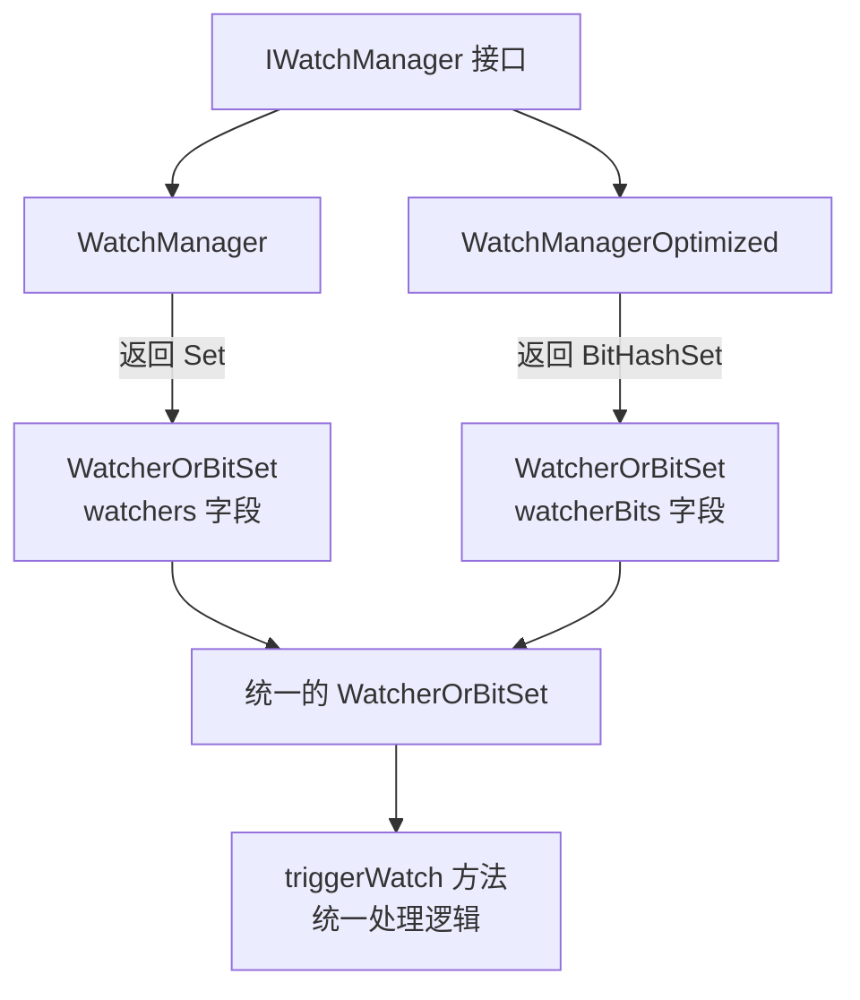
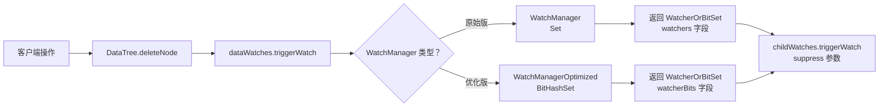

## 🎯 WatcherOrBitSet 的设计动机

### **核心问题：两种 WatchManager 的权衡**

ZooKeeper 有两种 WatchManager 实现，它们使用不同的数据结构存储 watcher：

| 实现 | 数据结构 | 优点 | 缺点 |
|------|---------|------|------|
| **WatchManager** | `Set<Watcher>` | 直接操作 Watcher 对象 | 内存占用大（对象引用） |
| **WatchManagerOptimized** | `BitHashSet` | 内存占用小（位图） | 需要间接映射 |

### **设计目标：统一接口**

`WatcherOrBitSet` 是一个**适配器类**，目的是让两种不同的 WatchManager 可以使用相同的返回类型。

## 📊 架构设计图




## 🔍 为什么需要这种设计？

### **1. 历史演进：性能优化**


**已查看文件** *WatchManagerOptimized.java 44-56*


完美！现在我可以给出完整的解释了。

## 🎯 WatcherOrBitSet 设计详解

### **1. 设计背景：性能优化的演进**

根据 `WatchManagerOptimized` 的注释（第 44-56 行），优化版本相比原始版本有显著改进：

```java
/**
 * Optimized in memory and time complexity, compared to WatchManager, 
 * both the memory consumption and time complexity improved a lot
 * 
 * Changed made compared to WatchManager:
 * - Use HashSet and BitSet to store the watchers 
 *   (在内存占用和时间复杂度之间找平衡)
 * - Use ReadWriteLock instead of synchronized 
 *   (减少锁竞争)
 * - Lazily clean up the closed watchers 
 *   (延迟清理，提高性能)
 */
```


### **2. 两种实现的数据结构对比**

#### **WatchManager（原始版本）**
```java
// WatchManager.java 第 127 行
Set<Watcher> watchers = new HashSet<>();

// 直接存储 Watcher 对象引用
watchTable: Map<String, Set<Watcher>>  // path -> Set<Watcher>
```


**优点**：
- ✅ 简单直观
- ✅ 可以直接访问 Watcher 对象

**缺点**：
- ❌ 内存占用大（每个 Watcher 引用约 24-32 字节）
- ❌ 大量 watcher 时性能下降

#### **WatchManagerOptimized（优化版本）**
```java
// WatchManagerOptimized.java 第 61-64 行
private final ConcurrentHashMap<String, BitHashSet> pathWatches;
private final BitMap<Watcher> watcherBitIdMap;

// 使用位图 + 映射表
pathWatches: Map<String, BitHashSet>    // path -> 位图
watcherBitIdMap: BitMap<Watcher>        // bit -> Watcher
```


**优点**：
- ✅ 内存占用极小（每个 watcher 只需 1 个 bit）
- ✅ 查找、添加速度快 O(1)
- ✅ 适合大规模 watcher 场景

**缺点**：
- ❌ 需要额外的映射层
- ❌ 不能直接获取 Watcher 对象

### **3. WatcherOrBitSet 的核心作用**

```java
public class WatcherOrBitSet {
    private Set<Watcher> watchers;      // 适配 WatchManager
    private BitHashSet watcherBits;     // 适配 WatchManagerOptimized
    
    public WatcherOrBitSet(final Set<Watcher> watchers) {
        this.watchers = watchers;
    }
    
    public WatcherOrBitSet(final BitHashSet watcherBits) {
        this.watcherBits = watcherBits;
    }
}
```


**设计意图**：
1. **统一返回类型**：让两种 WatchManager 的 `triggerWatch` 方法返回相同类型
2. **多态适配**：通过构造函数重载适配两种不同的数据结构
3. **向后兼容**：不破坏现有 API 接口

### **4. 实际使用场景**

#### **场景 1：WatchManager 使用 Watcher 对象**
```java
// WatchManager.java 第 198 行
return new WatcherOrBitSet(watchers);  // watchers 是 Set<Watcher>

// 调用方代码
WatcherOrBitSet result = watchManager.triggerWatch(path, event, acl);
if (result != null) {
    int count = result.size();  // 调用 watchers.size()
    boolean hasWatcher = result.contains(someWatcher);  // 检查 Watcher 对象
}
```


#### **场景 2：WatchManagerOptimized 使用位图**
```java
// WatchManagerOptimized.java 第 247 行
return new WatcherOrBitSet(watchers);  // watchers 是 BitHashSet

// 调用方代码
WatcherOrBitSet result = watchManager.triggerWatch(path, event, acl);
if (result != null) {
    int count = result.size();  // 调用 watcherBits.size()
    boolean hasWatcher = result.contains(watcherBit);  // 检查 bit 整数
}
```


#### **场景 3：抑制重复通知**
```java
// DataTree.java 第 638-639 行
// 删除节点时触发两个 watch，需要避免重复通知
WatcherOrBitSet processed = dataWatches.triggerWatch(path, EventType.NodeDeleted, acl);
childWatches.triggerWatch(path, EventType.NodeDeleted, acl, processed);  // 传入 suppress 参数

// IWatchManager.java 第 167-169 行
if (supress != null && supress.contains(w)) {
    continue;  // 跳过已处理的 watcher
}
```


### **5. 性能对比数据**

根据性能测试代码 `WatchBench.java`，ZooKeeper 提供了基准测试来对比两种实现：

```java
@Param({"WatchManager", "WatchManagerOptimized"})
public String watchManagerClass;

@Param({"10000"})
public int pathCount;  // 测试 10000 个路径
```


**预期性能差异**（基于设计）：
- **内存占用**：Optimized 版本节省约 90%+ 内存
- **吞吐量**：Optimized 版本在高并发下表现更好
- **延迟**：Optimized 版本使用读写锁，读操作不会阻塞

### **6. BitHashSet 的精妙设计**

```java
// BitHashSet.java 第 26-34 行
private final BitSet elementBits = new BitSet();  // 位图存储
private final Set<Integer> cache = new HashSet<>();  // 缓存常用元素
private final int cacheSize;  // 默认缓存 10 个元素
```


**为什么需要 cache？**
```java
/**
 * HashSet is used to optimize the iterating, if there is a single
 * element in this BitHashSet, but the bit is very large, without
 * HashSet we need to go through all the words before return that
 * element, which is not efficient.
 */
```


**示例**：
- 如果只有 1 个 watcher，但它的 bit 是 1000000
- 没有 cache：需要遍历整个 BitSet 的 1000000 位
- 有 cache：直接从 HashSet 获取，O(1) 时间复杂度

### **7. 完整的调用链路**




## 💡 设计模式分析

这是一个典型的 **适配器模式（Adapter Pattern）** + **策略模式（Strategy Pattern）** 的组合：

1. **适配器模式**：`WatcherOrBitSet` 适配了两种不同的内部实现
2. **策略模式**：`WatchManager` 和 `WatchManagerOptimized` 是可互换的策略
3. **开闭原则**：新增 WatchManager 实现不需要修改接口

## 🎓 总结

`WatcherOrBitSet` 的设计体现了 ZooKeeper 团队的高超技艺：

✅ **向后兼容**：保持 API 稳定  
✅ **性能优化**：支持高效的位图实现  
✅ **灵活性**：允许两种实现共存  
✅ **可扩展性**：易于添加新的 WatchManager 实现

这个看似简单的类实际上解决了分布式系统中常见的**性能 vs 兼容性**的权衡问题，是一个非常优秀的工程实践案例！