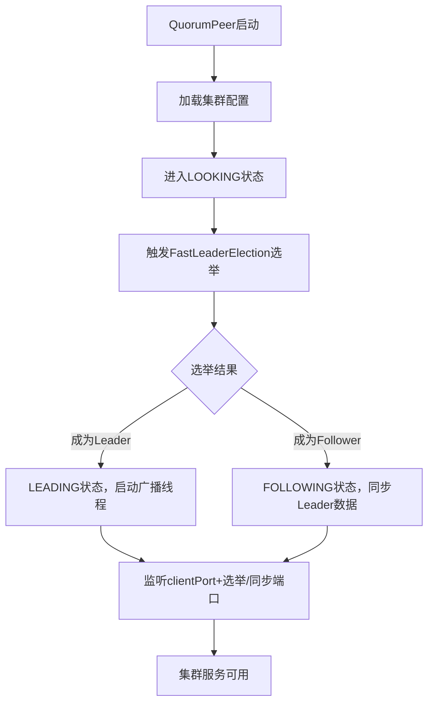

# 第三篇｜ZK 3.7启动流程：从main方法到集群可用（逐行源码解析）
大家好，上一篇我们搞定了ZK 3.7源码环境搭建，这一篇直接扎进核心——**逐行解析ZK的启动流程**，从`main`方法开始，讲清楚ZK是如何从一行代码，一步步初始化配置、启动网络、进入集群状态的。

理解启动流程是源码学习的“入门钥匙”，能帮你建立ZK的整体代码框架认知，后续看选举、ZAB、请求处理都会更清晰。

---

## 一、先明确核心概念：ZK的两种启动模式
ZK有两个核心启动入口类，对应两种运行模式，这是理解启动流程的前提：

| 启动类                  | 运行模式       | 适用场景                 | 核心逻辑                                                                 |
|-------------------------|----------------|--------------------------|--------------------------------------------------------------------------|
| `ZooKeeperServerMain`   | 单机模式       | 本地调试、单节点测试     | 仅启动单机服务，无选举、无集群协调，核心是初始化`ZooKeeperServer`        |
| `QuorumPeerMain`        | 集群模式       | 生产环境、多节点集群     | 初始化集群配置，启动`QuorumPeer`（集群核心类），触发选举、进入集群状态     |

我们先从**单机模式（ZooKeeperServerMain）** 讲透基础流程，再拓展集群模式的核心差异。

---

## 二、单机模式启动流程（核心）
### 1. 入口：main方法（ZooKeeperServerMain.java）
先找到源码位置：`zookeeper-server/src/main/java/org/apache/zookeeper/server/ZooKeeperServerMain.java`

核心代码（关键行已标注）：
```java
public static void main(String[] args) {
    ZooKeeperServerMain main = new ZooKeeperServerMain();
    try {
        // 核心步骤1：解析启动参数（配置文件路径）
        main.initializeAndRun(args);
    } catch (Exception e) {
        LOG.error("Unexpected exception, exiting abnormally", e);
        System.exit(ExitCode.INVALID_INVOCATION.getValue());
    }
    // 注册JVM关闭钩子，优雅停止服务
    Runtime.getRuntime().addShutdownHook(new Thread(() -> {
        main.shutdown();
    }));
}
```

**关键解读**：
- `initializeAndRun(args)`是启动的核心方法，入参是启动时指定的配置文件路径（如`conf/zoo.cfg`）；
- 注册`ShutdownHook`是为了JVM退出时，优雅关闭ZK服务（释放端口、刷盘、关闭连接）。

### 2. 核心步骤1：初始化配置（initializeAndRun）
```java
protected void initializeAndRun(String[] args) throws ConfigException, IOException {
    // 1. 解析命令行参数，获取配置文件路径
    ServerConfig config = new ServerConfig();
    if (args.length == 1) {
        config.parse(args[0]); // 解析zoo.cfg配置文件
    } else {
        throw new ConfigException("Must specify config file");
    }

    // 2. 启动ZK服务（核心）
    runFromConfig(config);
}
```

**关键解读**：
- `ServerConfig`负责解析`zoo.cfg`，把配置项（如`clientPort`、`dataDir`、`tickTime`）加载到内存；
- `runFromConfig`是真正启动服务的方法，也是我们要重点分析的。

### 3. 核心步骤2：启动服务（runFromConfig）
```java
public void runFromConfig(ServerConfig config) throws IOException {
    LOG.info("Starting server");
    // 1. 初始化数据目录（dataDir），创建快照、日志目录
    FileTxnSnapLog txnLog = new FileTxnSnapLog(new File(config.getDataDir()), new File(config.getDataLogDir()));
    
    // 2. 创建ZK核心服务实例
    final ZooKeeperServer zkServer = new ZooKeeperServer(txnLog, config.getTickTime(), 
                                                        config.getMinSessionTimeout(), config.getMaxSessionTimeout(), null);
    txnLog.setServerStats(zkServer.serverStats());

    // 3. 启动网络服务（NIO），绑定clientPort
    ServerCnxnFactory cnxnFactory = ServerCnxnFactory.createFactory();
    cnxnFactory.configure(config.getClientPortAddress(), config.getMaxClientCnxns());
    cnxnFactory.start(zkServer); // 启动NIO线程，监听端口

    // 4. 启动ZK核心服务
    zkServer.start();
    LOG.info("Started server");

    // 5. 等待服务停止（阻塞主线程）
    zkServer.join();
}
```

**逐行解读（核心中的核心）**：
| 代码行                          | 作用                                                                 |
|---------------------------------|----------------------------------------------------------------------|
| `FileTxnSnapLog`                | 初始化事务日志（FileTxnLog）和快照（SnapLog）管理器，负责数据持久化    |
| `ZooKeeperServer`实例化         | 创建ZK核心服务对象，封装会话、Watcher、数据树（DataTree）核心逻辑      |
| `ServerCnxnFactory.createFactory` | 创建NIO网络工厂（默认NIOServerCnxnFactory），处理客户端连接            |
| `cnxnFactory.configure`         | 绑定clientPort（如2181），设置最大客户端连接数                        |
| `cnxnFactory.start`             | 启动NIO线程（Accept线程+IO线程），开始监听客户端连接                  |
| `zkServer.start`                | 启动ZK核心服务，初始化会话管理器、Watcher管理器等                      |
| `zkServer.join`                 | 阻塞主线程，让服务一直运行（直到手动停止）                            |

### 4. 启动成功标志（控制台输出）
```
2026-02-27 11:00:00,000 [myid:] - INFO  [main:NIOServerCnxnFactory@89] - binding to port 0.0.0.0/0.0.0.0:2181
2026-02-27 11:00:00,100 [myid:] - INFO  [main:ZooKeeperServer@420] - Started ZooKeeper Server
```
此时ZK单机服务已启动，可通过`zkCli.sh -server 127.0.0.1:2181`连接。

---

## 三、集群模式启动流程（核心差异）
集群模式入口类是`QuorumPeerMain`，源码位置：`zookeeper-server/src/main/java/org/apache/zookeeper/server/quorum/QuorumPeerMain.java`

### 1. 核心差异：main方法到QuorumPeer启动
```java
public static void main(String[] args) {
    QuorumPeerMain main = new QuorumPeerMain();
    try {
        main.initializeAndRun(args); // 解析集群配置
    } catch (Exception e) {
        LOG.error("Unexpected exception, exiting abnormally", e);
        System.exit(1);
    }
}

protected void initializeAndRun(String[] args) throws ConfigException, IOException {
    // 1. 解析集群配置（zoo.cfg中的server.x配置）
    QuorumPeerConfig config = new QuorumPeerConfig();
    config.parse(args[0]);

    // 2. 启动QuorumPeer（集群核心）
    QuorumPeer quorumPeer = new QuorumPeer();
    quorumPeer.setQuorumPeers(config.getQuorumPeers()); // 设置集群节点列表
    quorumPeer.setTickTime(config.getTickTime());
    quorumPeer.setClientPortAddress(config.getClientPortAddress());
    // ... 省略其他配置
    
    // 3. 启动QuorumPeer，触发选举
    quorumPeer.start();
    quorumPeer.join();
}
```

### 2. 集群启动的核心差异点
| 单机模式                | 集群模式                  | 核心影响                                                                 |
|-------------------------|---------------------------|--------------------------------------------------------------------------|
| 启动`ZooKeeperServer`   | 启动`QuorumPeer`          | `QuorumPeer`是集群核心，封装选举、ZAB、集群状态管理                      |
| 无选举流程              | 启动后进入LOOKING状态     | 触发FastLeaderElection选举，选举完成后进入LEADING/FOLLOWING状态          |
| 仅监听clientPort        | 额外监听选举/同步端口     | 如3888（选举）、2888（数据同步），用于节点间通信                        |

### 3. 集群启动核心状态流转


---

## 四、启动流程核心类总结（一张图理清）
为了方便你记忆，整理启动流程中最核心的类及其作用：

| 类名                  | 核心作用                                                                 |
|-----------------------|--------------------------------------------------------------------------|
| `ZooKeeperServerMain` | 单机模式入口，解析配置、启动单机服务                                     |
| `QuorumPeerMain`      | 集群模式入口，解析集群配置、启动QuorumPeer                               |
| `ServerConfig`        | 单机配置解析器，加载zoo.cfg中的基础配置                                  |
| `QuorumPeerConfig`    | 集群配置解析器，加载zoo.cfg中的server.x、quorum等集群配置                |
| `ServerCnxnFactory`   | 网络工厂，创建NIO线程，监听clientPort，处理客户端连接                    |
| `ZooKeeperServer`     | ZK核心服务，封装数据树、会话、Watcher、事务日志等核心逻辑                |
| `QuorumPeer`          | 集群核心，管理集群状态（LOOKING/LEADING/FOLLOWING）、选举、ZAB协议       |
| `FileTxnSnapLog`      | 事务日志和快照管理器，负责数据持久化和恢复                              |

---

## 五、实战调试技巧（快速定位问题）
1. **断点调试**：在`ZooKeeperServerMain`的`main`方法、`runFromConfig`方法打断点，一步步执行，观察变量值（如config、zkServer）；
2. **日志排查**：启动失败时，优先看ZK日志（默认在`dataDir/logs`），关键词：`binding to port`（端口绑定）、`txnlog`（日志初始化）、`quorum`（集群配置）；
3. **核心排查点**：
    - 端口被占用：看`clientPort`是否被占用，集群模式还要检查3888/2888；
    - 配置解析失败：检查`zoo.cfg`格式，是否有拼写错误（如`dataDir`写成`datadir`）；
    - 数据目录权限：`dataDir`/`dataLogDir`是否有读写权限。

---

## 六、写在最后
启动流程是ZK源码的“骨架”，理解了它，你就建立了ZK的整体代码认知。下一篇我们会聚焦ZK的**网络模型**，解析`NIOServerCnxnFactory`是如何实现高并发网络通信的——这是ZK能扛高并发的核心原因。

如果这篇内容帮你理清了启动流程，欢迎点赞、收藏、关注，后续我们会一步步啃透ZK的每一个核心模块！

### CSDN专属标签
#ZooKeeper3.7 #ZK启动流程 #分布式系统源码 #Java中间件 #源码调试 #QuorumPeer

---

### 小预告
下一篇内容：《第四篇｜ZK 3.7网络模型：自研NIO为什么能扛高并发？（源码解析）》，会重点讲解`NIOServerCnxnFactory`、`NIOServerCnxn`等核心类，提前可以先在IDEA中打开这些类熟悉一下~