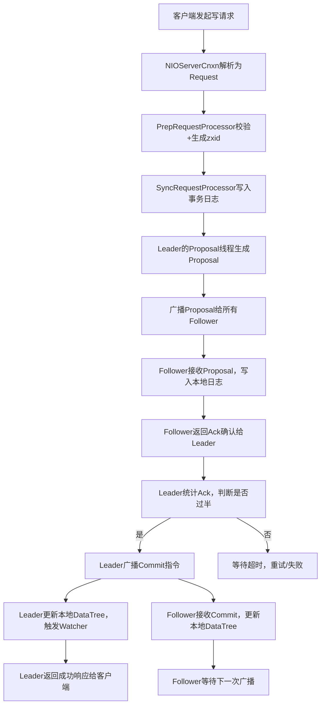

# 第九篇｜ZK 3.7 ZAB 协议（下）：消息广播（写请求全流程源码解析）
大家好，上一篇我们吃透了 ZAB 协议的崩溃恢复阶段，解决了“集群异常后数据如何对齐”的问题。这一篇我们聚焦 ZAB 协议的核心——**消息广播阶段**，也是 ZK 处理写请求的全流程。

ZK 所有写请求（create/delete/setData）的一致性，全靠消息广播机制保证。这一篇我们从源码层面，逐行解析“写请求如何从客户端发起，经过 Leader 广播、Follower 确认，最终完成全集群数据一致”，同时讲清 ZAB 与二阶段提交的区别、过半确认的底层逻辑，彻底搞懂 ZK 强一致性的实现。

---

## 一、先理清：消息广播的核心目标
崩溃恢复阶段完成后，集群进入“正常运行状态”：1 个 Leader + N 个 Follower（Observer 不参与广播确认），此时所有写请求必须经过 Leader 处理，通过 ZAB 消息广播机制，保证：
1.  **所有节点都能同步到相同的写请求**（无数据差异）；
2.  **写请求的顺序完全一致**（不乱序）；
3.  **写请求要么全成功，要么全失败**（原子性）；
4.  **只有过半节点确认，写请求才算真正成功**（避免数据丢失）。

一句话总结：**消息广播，就是 Leader 带领所有 Follower 完成“写请求同步”的过程**，是 ZK 强一致性的核心落地。

---

## 二、消息广播的整体流程（与写请求绑定）
ZK 写请求的全流程 = 客户端发起 → 网络层接收 → 请求处理链 → ZAB 消息广播 → 响应客户端，其中 **ZAB 消息广播是核心环节**，整体流程如下：



### 核心说明：
- ZAB 消息广播本质是 **“简化版二阶段提交”**：Proposal（准备）→ Commit（提交），没有 Abort（中止）阶段（ZK 设计简化，避免复杂逻辑）；
- 所有写请求必须经过 Leader，Follower 不能直接处理写请求（只能转发给 Leader）；
- 过半确认是核心：Leader 必须收到超过半数 Follower 的 Ack，才能发起 Commit 指令。

---

## 三、核心概念：Proposal（提案）与事务ID（zxid）
消息广播的核心载体是 **Proposal（提案）**，每个写请求对应一个 Proposal，Proposal 中包含两个关键信息：
1.  **zxid**：事务ID，唯一标识一个写请求，结构为 `(epoch << 32) | counter`（高32位是选举轮次，低32位是事务计数器）；
2.  **事务内容**：如创建节点的路径、数据、ACL 权限，删除节点的路径等。

### 关键规则（源码强制约束）：
- 每个 Proposal 都有唯一的 zxid，**zxid 严格自增**（Leader 处理写请求时，counter 每次+1）；
- 同一 epoch 内，zxid 严格有序，保证写请求的顺序性；
- Follower 只能接收 zxid 比自己当前最大 zxid 大的 Proposal（避免乱序）。

---

## 四、源码解析：消息广播全流程（从Leader到Follower）
我们按“Leader 处理写请求 → 广播 Proposal → Follower 确认 → Leader 发起 Commit”的顺序，逐行解析源码。

### 1. 第一步：Leader 接收写请求（请求处理链触发）
上一篇我们讲过，写请求经过 `PrepRequestProcessor` 校验、`SyncRequestProcessor` 写入事务日志后，会进入 Leader 的 **Proposal 处理逻辑**，源码位置：`org.apache.zookeeper.server.quorum.Leader`

```java
// Leader 处理写请求，生成 Proposal 并广播
public void submitRequest(Request request) {
    // 1. 生成 zxid（epoch 不变，counter 自增）
    long zxid = getNextZxid();
    request.setZxid(zxid);
    
    // 2. 生成 Proposal（提案），封装 zxid 和事务内容
    Proposal proposal = new Proposal(request);
    
    // 3. 将 Proposal 加入本地提案队列（用于重试）
    outstandingProposals.put(zxid, proposal);
    
    // 4. 广播 Proposal 给所有 Follower（核心步骤）
    broadcastProposal(proposal);
}
```

**关键解读**：
- `getNextZxid()`：生成下一个 zxid，核心逻辑是 `currentZxid += 1`（currentZxid 是 Leader 当前最大 zxid）；
- `outstandingProposals`：用于存储“已广播但未收到过半 Ack”的 Proposal，避免广播丢失后无法重试；
- `broadcastProposal`：广播 Proposal 的核心方法，通过 TCP 连接发送给所有 Follower（默认端口 2888）。

### 2. 第二步：Leader 广播 Proposal（broadcastProposal 源码）
```java
private void broadcastProposal(Proposal proposal) {
    // 1. 获取所有 Follower 节点（排除 Observer，Observer 不参与 Ack 确认）
    Collection<LearnerHandler> followers = getFollowerHandlers();
    
    // 2. 遍历 Follower，逐个发送 Proposal（点对点广播，非组播）
    for (LearnerHandler handler : followers) {
        try {
            // 发送 Proposal 数据（包含 zxid、事务内容）
            handler.sendProposal(proposal);
        } catch (IOException e) {
            LOG.error("Failed to send proposal to follower " + handler.getLearnerId(), e);
            // 发送失败，标记该 Follower 异常，后续重试
            handler.setFailed(true);
        }
    }
    
    // 3. 启动超时计时器（如果超时未收到过半 Ack，重试广播）
    startProposalTimer(proposal);
}
```

**关键解读**：
- ZK 采用 **点对点广播**，而非组播：Leader 逐个给 Follower 发送 Proposal，确保每个 Follower 都能收到（组播可能存在丢包风险）；
- Observer 不参与 Ack 确认：Observer 只同步 Proposal，不返回 Ack，不影响过半统计（仅用于提升读性能）；
- 超时重试机制：如果超过指定时间（默认 2000ms）未收到过半 Ack，会重新广播该 Proposal。

### 3. 第三步：Follower 接收 Proposal 并返回 Ack
Follower 通过 `LearnerHandler` 接收 Leader 发送的 Proposal，源码位置：`org.apache.zookeeper.server.quorum.LearnerHandler`

```java
// Follower 接收 Proposal 并处理
public void processProposal(Proposal proposal) {
    long zxid = proposal.getZxid();
    Request request = proposal.getRequest();
    
    // 1. 校验 zxid：必须比当前最大 zxid 大（避免乱序）
    if (zxid <= self.getLastLoggedZxid()) {
        LOG.warn("Received out-of-order proposal zxid: " + zxid);
        return;
    }
    
    // 2. 将 Proposal 写入本地事务日志（持久化，避免重启丢失）
    self.getTxnLogFactory().append(request.getHdr(), request.getTxn());
    
    // 3. 更新本地最大 zxid
    self.setLastLoggedZxid(zxid);
    
    // 4. 返回 Ack 确认给 Leader（告知 Leader：我已收到并持久化 Proposal）
    sendAck(zxid);
}
```

**关键解读**：
- Follower 接收 Proposal 后，**先持久化到本地事务日志**，再返回 Ack：确保即使 Follower 宕机，重启后能通过日志恢复 Proposal，避免数据丢失；
- zxid 校验：如果收到的 zxid 小于等于自己当前最大 zxid，直接丢弃（避免重复处理或乱序处理）；
- `sendAck(zxid)`：Ack 消息中只包含 zxid，用于 Leader 统计确认情况。

### 4. 第四步：Leader 统计 Ack，发起 Commit 指令
Leader 接收 Follower 的 Ack 后，统计确认数量，当达到过半阈值时，发起 Commit 指令，源码位置：`org.apache.zookeeper.server.quorum.Leader`

```java
// 处理 Follower 返回的 Ack
public void processAck(long zxid, long followerId) {
    // 1. 获取该 zxid 对应的 Proposal
    Proposal proposal = outstandingProposals.get(zxid);
    if (proposal == null) {
        return; //  Proposal 已被处理（如超时重试），直接忽略
    }
    
    // 2. 统计该 Proposal 的 Ack 数量（自己默认算1票）
    proposal.addAck(followerId);
    int ackCount = proposal.getAckCount() + 1; // +1 是 Leader 自己的票
    
    // 3. 判断是否达到过半阈值
    if (ackCount >= self.getQuorumSize()) {
        // 3.1 取消超时计时器（无需重试）
        cancelProposalTimer(zxid);
        
        // 3.2 广播 Commit 指令，通知所有 Follower 提交事务
        broadcastCommit(zxid);
        
        // 3.3 Leader 自己提交事务（更新内存 DataTree，触发 Watcher）
        commitProposal(proposal);
        
        // 3.4 移除已处理的 Proposal
        outstandingProposals.remove(zxid);
    }
}
```

**关键解读**：
- Ack 统计规则：Leader 自己默认算 1 票，加上 Follower 的 Ack 数量，达到 `quorumSize`（过半阈值，如 3 节点=2，5 节点=3）即可发起 Commit；
- `broadcastCommit(zxid)`：只广播 zxid，不广播完整 Proposal（Follower 已持久化 Proposal，只需确认提交即可）；
- `commitProposal`：Leader 自己提交事务，更新内存中的 DataTree，触发对应的 Watcher 事件（如 NodeCreated）。

### 5. 第五步：Follower 接收 Commit，完成事务提交
Follower 接收 Leader 的 Commit 指令后，提交事务、更新内存，源码位置：`org.apache.zookeeper.server.quorum.Follower`

```java
// Follower 处理 Leader 的 Commit 指令
public void processCommit(long zxid) {
    // 1. 从本地日志中获取该 zxid 对应的 Proposal
    Proposal proposal = getProposalFromLog(zxid);
    if (proposal == null) {
        LOG.error("Commit zxid " + zxid + " not found in local log");
        return;
    }
    
    // 2. 提交事务，更新本地 DataTree（内存）
    Request request = proposal.getRequest();
    commitRequest(request);
    
    // 3. 触发 Watcher 事件（与 Leader 同步）
    self.getDataTree().triggerWatch(request.getPath(), getEventType(request));
}
```

**关键解读**：
- Follower 提交事务时，直接从本地日志中获取 Proposal（已在接收阶段持久化），无需再次从 Leader 获取；
- `commitRequest`：更新本地 DataTree，完成数据同步，此时 Follower 的数据与 Leader 完全一致；
- Watcher 触发：Follower 与 Leader 同步触发 Watcher 事件，确保客户端能收到一致的 Watch 通知。

---

## 五、核心重点：ZAB 广播与二阶段提交的区别（面试必问）
很多人会把 ZAB 广播和二阶段提交（2PC）混淆，这里明确两者的核心区别，结合源码总结：

| 对比维度 | ZAB 消息广播 | 二阶段提交（2PC） |
|----------|--------------|-------------------|
| 核心目的 | 保证分布式数据一致性（适配 ZK 场景） | 保证分布式事务一致性 |
| 阶段划分 | Proposal（准备）→ Commit（提交） | Prepare（准备）→ Commit（提交）/ Abort（中止） |
| 容错能力 | Leader 宕机后，通过崩溃恢复重新同步，不影响数据 | 协调者宕机可能导致参与者阻塞 |
| 决策机制 | 过半确认（无需所有节点确认） | 需所有参与者确认才能提交 |
| 简化设计 | 无 Abort 阶段（写请求要么过半成功，要么失败重试） | 有 Abort 阶段，逻辑更复杂 |

**一句话总结**：ZAB 是“简化版 2PC”，去掉了 Abort 阶段，用过半确认替代“全节点确认”，兼顾一致性和性能，更适配 ZK 分布式协调的场景。

---

## 六、生产实战：消息广播的常见问题与排查
基于源码逻辑，生产中消息广播的问题主要集中在“广播超时、Ack 不足、数据不一致”，整理高频问题排查方法：

| 问题现象 | 常见原因 | 排查方向 |
|----------|----------|----------|
| 写请求卡顿，响应慢 | 1. Leader 广播 Proposal 超时；2. Follower 日志刷盘慢；3. 网络延迟高 | 1. 查看 Leader 日志，关键词“proposal timeout”；2. 检查 Follower 磁盘 IO；3. 测试 Leader 与 Follower 的网络连通性（2888 端口） |
| 写请求失败，提示“not enough acks” | 1. 集群节点数不足（如 3 节点挂了 2 个）；2. 部分 Follower 异常（未返回 Ack） | 1. 检查集群节点状态，确保存活节点数≥过半阈值；2. 查看 Follower 日志，关键词“sendAck failed” |
| Follower 与 Leader 数据不一致 | 1. Follower 未接收或处理 Proposal；2. zxid 校验失败（乱序） | 1. 对比 Leader 和 Follower 的最大 zxid；2. 查看 Follower 日志，关键词“out-of-order proposal” |

---

## 七、高频面试题（源码级答案）
结合本篇源码，整理 ZAB 消息广播的高频面试题，直接用在面试中：

### 问题1：ZK 的写请求全流程是什么？（结合 ZAB 广播）
答：1. 客户端发起写请求，由 Leader 接收（Follower 转发）；2. Leader 校验请求、生成 zxid 和 Proposal；3. Leader 广播 Proposal 给所有 Follower；4. Follower 接收 Proposal 并持久化，返回 Ack 给 Leader；5. Leader 统计 Ack，达到过半阈值后，广播 Commit 指令；6. Leader 和 Follower 分别提交事务、更新内存 DataTree；7. Leader 返回成功响应给客户端。

### 问题2：ZAB 消息广播为什么需要过半确认？
答：核心是为了兼顾一致性和容错性。过半确认能保证：即使部分 Follower 宕机，只要存活节点数≥过半阈值，写请求就能正常提交；同时避免脑裂（只有一个 Leader 能收到过半 Ack，发起 Commit），保证数据一致性。

### 问题3：Follower 接收 Proposal 后，为什么先持久化再返回 Ack？
答：为了避免数据丢失。如果 Follower 先返回 Ack，再持久化 Proposal，此时 Follower 宕机，Proposal 未被持久化，重启后会丢失该事务，导致与 Leader 数据不一致；先持久化再返回 Ack，能确保 Follower 即使宕机，重启后也能通过日志恢复 Proposal，保证数据同步。

---

## 八、写在最后
这两篇我们彻底啃透了 ZAB 协议的两个核心阶段——崩溃恢复（异常对齐数据）和消息广播（正常同步写请求），这是 ZK 强一致性、高可用的底层灵魂。理解了 ZAB，你就掌握了 ZK 最核心的技术壁垒。

下一篇我们会进入 ZK 的会话管理机制，解析 **Session 超时、分桶算法、心跳机制**——这是 ZK 维持客户端连接、保证会话有效性的核心，也是生产中“会话超时”“连接异常”等问题的排查关键。

如果这篇内容帮你理清了 ZAB 消息广播的源码逻辑，欢迎点赞、收藏、关注，后续我们会一步步啃透 ZK 的每一个核心模块！

### CSDN专属标签
#ZooKeeper3.7 #ZAB协议 #消息广播 #分布式一致性 #ZK写请求流程 #中间件源码 #二阶段提交

---

### 小预告
下一篇内容：《第十篇｜ZK 3.7 会话管理：Session 超时、分桶算法与心跳机制（源码解析）》，会重点讲解 `SessionTrackerImpl` 分桶算法、会话创建/心跳/过期逻辑，提前可以先在 IDEA 中打开 `SessionTrackerImpl` 类熟悉一下~