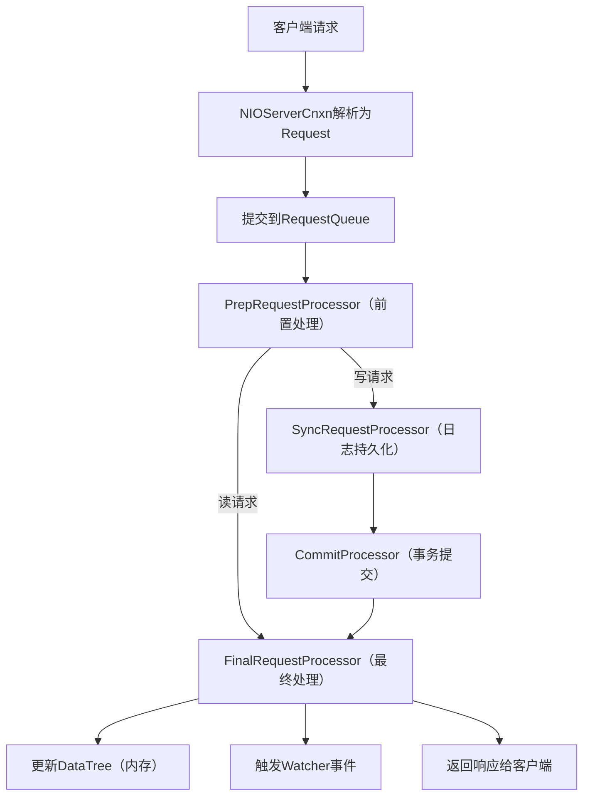

# 第五篇｜ZK 3.7请求处理链：所有客户端命令的统一入口（源码解析）
大家好，上一篇我们吃透了ZK的NIO网络模型，知道了客户端请求如何通过网络到达服务端。这一篇我们聚焦ZK的“请求处理中枢”——**RequestProcessor责任链**，讲清楚所有客户端命令（如create/ls/delete/setData）是如何被拆解、处理、持久化、返回响应的。

ZK的请求处理链是“责任链设计模式”的经典实战，理解它不仅能搞懂ZK的核心流程，还能学到这种设计模式在分布式系统中的落地思路。

---

## 一、先理清核心概念：请求处理链的整体设计
### 1. 为什么用责任链？
ZK的请求处理涉及多个环节：**参数校验 → 事务日志持久化 → 内存数据更新 → 响应返回 → Watcher触发**，如果把所有逻辑写在一个类里，会导致代码臃肿、耦合度高、难以扩展。

责任链模式的优势：
- **职责分离**：每个处理器只做一件事，比如`SyncRequestProcessor`只负责写日志，`FinalRequestProcessor`只负责更新内存；
- **灵活扩展**：新增处理逻辑只需加一个处理器，无需修改原有代码；
- **流程可控**：可按需调整处理器顺序，或跳过某些处理器（如读请求无需写日志）。

### 2. 核心请求类型与处理流程
ZK请求分为两类，处理流程差异极大，这是理解责任链的关键：

| 请求类型 | 示例命令       | 核心特征                | 处理流程                                                                 |
|----------|----------------|-------------------------|--------------------------------------------------------------------------|
| 读请求   | ls / get / exists | 无需持久化、无事务ID    | PrepRequestProcessor → FinalRequestProcessor（直接查内存，返回结果）|
| 写请求   | create / delete / setData | 需持久化、生成事务ID | PrepRequestProcessor → SyncRequestProcessor → FinalRequestProcessor（校验→写日志→更新内存→触发Watcher） |

### 3. 整体流程架构图


---

## 二、核心接口：RequestProcessor（所有处理器的父接口）
先看最基础的接口定义，源码位置：`zookeeper-server/src/main/java/org/apache/zookeeper/server/RequestProcessor.java`

```java
public interface RequestProcessor {
    // 处理单个请求
    void processRequest(Request request) throws RequestProcessorException;
    
    // 启动处理器（如启动日志刷盘线程）
    void start();
    
    // 关闭处理器（释放资源）
    void shutdown();
    
    // 设置下一个处理器（责任链的核心）
    void setNext(RequestProcessor nextProcessor);
}
```

**关键解读**：
- `processRequest`是核心方法，每个处理器实现自己的处理逻辑；
- `setNext`用于构建责任链，当前处理器处理完后，调用下一个处理器的`processRequest`；
- 所有处理器都遵循“处理自己的逻辑 → 调用下一个处理器”的规则。

---

## 三、核心处理器解析（按执行顺序）
### 1. PrepRequestProcessor（前置处理器，所有请求的入口）
**核心职责**：
- 校验请求参数（如路径是否合法、权限是否足够）；
- 为写请求生成事务ID（zxid）；
- 区分读写请求，分流到不同的后续处理器；
- 处理会话创建、关闭等特殊请求。

源码位置：`zookeeper-server/src/main/java/org/apache/zookeeper/server/PrepRequestProcessor.java`

#### 核心代码（processRequest）
```java
public void processRequest(Request request) throws RequestProcessorException {
    // 1. 跳过已取消的请求
    if (request.isCanceled()) {
        return;
    }
    
    ZooKeeperServer zkServer = getZooKeeperServer();
    try {
        // 2. 校验会话（会话超时则拒绝）
        if (!zkServer.isRunning() || !zkServer.getSessionTracker().isSessionAlive(request.getSessionId())) {
            throw new SessionExpiredException();
        }
        
        // 3. 处理不同类型的请求
        switch (request.getType()) {
            case OpCode.create: // 创建节点
                createRequest(request);
                break;
            case OpCode.delete: // 删除节点
                deleteRequest(request);
                break;
            case OpCode.getData: // 读数据
                // 读请求无需额外处理，直接交给下一个处理器
                break;
            // ... 省略其他请求类型
        }
        
        // 4. 调用下一个处理器（核心：责任链传递）
        if (nextProcessor != null) {
            nextProcessor.processRequest(request);
        }
    } catch (Exception e) {
        // 异常处理，返回错误响应
        request.setException(e);
        if (nextProcessor != null) {
            nextProcessor.processRequest(request);
        }
    }
}
```

**关键解读**：
- 写请求会在这里做参数校验（如节点路径是否合法、是否有创建权限），校验失败直接返回异常；
- 读请求几乎无处理逻辑，快速传递到下一个处理器；
- 所有异常都会被捕获，并传递给下一个处理器，最终返回给客户端。

### 2. SyncRequestProcessor（同步处理器，仅处理写请求）
**核心职责**：
- 将写请求的事务日志写入磁盘（FileTxnLog）；
- 定期生成快照（Snapshot）；
- 日志刷盘完成后，传递给下一个处理器。

源码位置：`zookeeper-server/src/main/java/org/apache/zookeeper/server/SyncRequestProcessor.java`

#### 核心代码（processRequest）
```java
public void processRequest(Request request) {
    // 1. 只处理写请求（读请求直接跳过）
    if (request.getType() == OpCode.sync) {
        // sync命令特殊处理，强制刷盘
        syncQueue.add(request);
    } else if (Request.isValidTxn(request.getType())) {
        // 写请求加入队列，异步刷盘
        txnQueue.add(request);
    } else {
        // 读请求直接传递给下一个处理器
        if (nextProcessor != null) {
            nextProcessor.processRequest(request);
        }
        return;
    }
}

// 后台刷盘线程（核心）
class SyncThread extends Thread {
    public void run() {
        while (true) {
            try {
                // 1. 从队列中取请求
                Request request = txnQueue.take();
                // 2. 写入事务日志
                zkServer.getTxnLogFactory().append(request.getHdr(), request.getTxn());
                // 3. 定期刷盘（默认每1000个请求或1秒）
                if (++pendingSyncs % SYNC_PERIOD == 0) {
                    zkServer.getTxnLogFactory().sync();
                }
                // 4. 传递给下一个处理器
                if (nextProcessor != null) {
                    nextProcessor.processRequest(request);
                }
            } catch (Exception e) {
                LOG.error("Sync thread error", e);
            }
        }
    }
}
```

**关键解读**：
- 写请求会被加入`txnQueue`，由后台`SyncThread`异步刷盘，避免阻塞IO线程；
- 刷盘策略：默认每1000个请求或1秒刷一次盘（可通过`syncLimit`配置），保证数据不丢失；
- 读请求直接跳过，不进入此处理器。

### 3. FinalRequestProcessor（最终处理器，所有请求的终点）
**核心职责**：
- 读请求：从DataTree（内存树）中查询数据，返回结果；
- 写请求：更新DataTree（创建/删除/修改节点），触发Watcher事件；
- 构建响应，返回给客户端。

源码位置：`zookeeper-server/src/main/java/org/apache/zookeeper/server/FinalRequestProcessor.java`

#### 核心代码（processRequest）
```java
public void processRequest(Request request) {
    // 1. 处理异常请求（前置处理器抛出的异常）
    if (request.getException() != null) {
        // 构建错误响应
        response = new Response(request.getException());
        sendResponse(request, response);
        return;
    }
    
    ZooKeeperServer zkServer = getZooKeeperServer();
    DataTree dataTree = zkServer.getDataTree();
    
    try {
        switch (request.getType()) {
            case OpCode.getData: // 读数据
                // 从DataTree中查询节点数据
                byte[] data = dataTree.getData(request.getPath(), request.getWatchRegistration(), true);
                // 构建成功响应
                response = new Response(data);
                break;
            case OpCode.create: // 创建节点
                // 更新DataTree（内存）
                String path = dataTree.createNode(request.getPath(), request.getData(), 
                                                  request.getAcl(), request.getCreateMode());
                // 触发Watcher事件（如节点创建事件）
                dataTree.triggerWatch(request.getPath(), EventType.NodeCreated);
                response = new Response(path);
                break;
            // ... 省略其他请求类型
        }
        
        // 2. 发送响应给客户端
        sendResponse(request, response);
    } catch (Exception e) {
        sendResponse(request, new Response(e));
    }
}

// 发送响应
private void sendResponse(Request request, Response response) {
    // 将响应写入NIOServerCnxn的输出缓冲区，由IO线程发送给客户端
    request.getCnxn().sendResponse(response);
}
```

**关键解读**：
- `DataTree`是ZK的内存数据结构，所有读/写操作最终都落地到这里；
- 写请求完成后会触发对应的Watcher事件（如NodeCreated/NodeDeleted），这是Watcher机制的核心触发点；
- `sendResponse`将响应写入网络层的输出缓冲区，由之前讲的NIOServerCnxn IO线程发送给客户端。

---

## 四、实战关键点（面试/生产必知）
### 1. 读写请求的性能差异原因
- 读请求：全程在内存中处理，无磁盘IO，速度极快；
- 写请求：必须经过日志刷盘（磁盘IO），速度受磁盘性能限制；
- 生产调优：通过`syncLimit`调整刷盘频率，或使用SSD提升写性能。

### 2. 责任链的扩展方式（自定义处理器）
如果想在ZK中新增处理逻辑（如请求限流、审计日志），只需：
1. 实现`RequestProcessor`接口；
2. 在`PrepRequestProcessor`后、`SyncRequestProcessor`前插入自定义处理器；
3. 无需修改原有处理器代码，符合“开闭原则”。

### 3. 常见问题排查
| 问题现象                     | 排查方向                                                                 |
|------------------------------|--------------------------------------------------------------------------|
| 写请求卡顿                   | 查看`SyncRequestProcessor`的刷盘线程是否阻塞（磁盘IO慢、日志文件过大）|
| 读请求返回旧数据             | 检查`FinalRequestProcessor`是否正确读取`DataTree`，或集群同步是否完成     |
| 请求权限校验失败             | 查看`PrepRequestProcessor`的权限校验逻辑，检查ACL配置                   |

---

## 五、核心总结（责任链核心逻辑）
1. **入口**：所有请求先经过`PrepRequestProcessor`，做参数校验和分流；
2. **分流**：读请求直接到`FinalRequestProcessor`，写请求先到`SyncRequestProcessor`刷日志；
3. **终点**：`FinalRequestProcessor`负责更新内存、触发Watcher、返回响应；
4. **扩展**：新增逻辑只需实现`RequestProcessor`，插入责任链即可。

---

## 六、写在最后
ZK的请求处理链是“责任链模式”的完美落地，把复杂的请求处理逻辑拆解得清晰、可控。理解了它，你不仅搞懂了ZK的请求处理流程，还能把这种设计模式用到自己的项目中（如接口请求的参数校验、日志记录、权限控制）。

下一篇我们会聚焦ZK最核心的分布式能力——**Leader选举**，解析`FastLeaderElection`的源码实现，讲清楚ZK集群是如何选出Leader、避免脑裂的。

如果这篇内容帮你理清了请求处理链，欢迎点赞、收藏、关注，后续我们会一步步啃透ZK的每一个核心模块！

### CSDN专属标签
#ZooKeeper3.7 #ZK请求处理链 #责任链模式 #分布式系统源码 #RequestProcessor #中间件源码

---

### 小预告
下一篇内容：《第六篇｜ZK 3.7 Leader选举（上）：FastLeaderElection机制（源码解析）》，会重点讲解选举触发条件、投票数据结构、选举流程，提前可以先在IDEA中打开`FastLeaderElection`类熟悉一下~