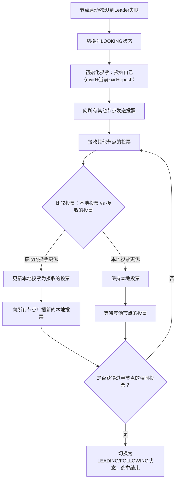

# 第六篇｜ZK 3.7 Leader选举（上）：FastLeaderElection机制（源码解析）
大家好，上一篇我们吃透了ZK的请求处理链，这一篇开始进入ZK分布式能力的核心——**Leader选举**。ZK集群能保证高可用、数据一致性，全靠Leader选举机制；而ZK 3.7中唯一使用的选举算法是`FastLeaderElection`（快速领导者选举），也是面试中最高频的考点。

这一篇我们先讲透选举的核心概念、触发条件、投票数据结构，下一篇再深入源码级的投票逻辑和过半确认机制，让你不仅能看懂源码，还能讲清“为什么这么设计”“生产中选举失败该怎么排查”。

---

## 一、先理清核心概念：为什么需要Leader选举？
ZK集群遵循“主从架构”：
- **Leader**：处理所有写请求，生成事务日志，同步数据给Follower；
- **Follower**：处理读请求，转发写请求给Leader，参与选举和数据同步；
- **Observer**：仅处理读请求，不参与选举（可选角色，提升读性能）。

如果Leader节点挂了，集群会失去写能力，必须快速选出新的Leader——这就是选举的核心目的：**保证集群的高可用，维持数据一致性**。

### 1. 选举的核心约束
ZK选举必须满足两个核心原则，否则会导致数据不一致或脑裂：
- **过半确认**：只有获得超过半数节点的投票，才能成为Leader（如3节点集群需2票，5节点需3票）；
- **数据最新优先**：投票时优先选择数据最新的节点（通过zxid判断），保证新Leader的数据是集群中最全的。

### 2. 选举触发的3种场景
| 触发场景 | 典型案例 | 核心特征 |
|----------|----------|----------|
| 集群启动 | 3节点集群首次启动 | 所有节点初始状态为LOOKING，主动发起选举 |
| Leader宕机 | Leader节点进程崩溃/网络断开 | Follower检测到Leader失联，切换为LOOKING状态，触发选举 |
| 集群扩容/缩容 | 新增节点或移除节点 | 集群配置变更后，重新选举以保证Leader合法性 |

---

## 二、核心数据结构：投票（Vote）与比较规则
选举的本质是“节点间交换投票，选出最优节点”，首先要搞懂投票的构成和比较规则——这是源码的基础。

### 1. 投票的核心字段（Vote类）
源码位置：`zookeeper-server/src/main/java/org/apache/zookeeper/server/quorum/Vote.java`
```java
public class Vote implements Serializable {
    // 候选节点的myid（zoo.cfg中配置的server.x的x）
    private final long id;
    // 候选节点的事务ID（zxid，越大表示数据越新）
    private final long zxid;
    // 选举轮次（epoch，避免跨轮次投票混乱）
    private final long epoch;
    
    // 构造方法
    public Vote(long id, long zxid, long epoch) {
        this.id = id;
        this.zxid = zxid;
        this.epoch = epoch;
    }
    
    // 投票比较规则（核心方法）
    public boolean isBetterThan(Vote other) {
        // 1. 优先比较epoch（轮次），大的优先
        if (epoch > other.epoch) return true;
        if (epoch < other.epoch) return false;
        // 2. epoch相同，比较zxid（数据最新），大的优先
        if (zxid > other.zxid) return true;
        if (zxid < other.zxid) return false;
        // 3. zxid相同，比较myid（节点ID），大的优先
        return id > other.id;
    }
}
```

**关键解读**：
- **myid**：节点唯一标识，在`dataDir/myid`文件中配置，集群中不能重复；
- **zxid**：事务ID，每处理一个写请求，zxid自增1，是数据最新程度的核心指标；
- **epoch**：选举轮次，每轮选举生成一个唯一epoch，避免旧轮次的投票干扰新选举；
- **isBetterThan**：投票比较的核心方法，决定“谁更适合当Leader”。

### 2. 投票比较规则（面试必背）
ZK选举的核心逻辑可以总结为一句话：
> **先比epoch，再比zxid，最后比myid，谁大谁赢**。

举个例子：
- 节点A：myid=1，zxid=100，epoch=2；
- 节点B：myid=2，zxid=99，epoch=2；
- 节点C：myid=3，zxid=100，epoch=1；

投票比较结果：A > B（zxid更大），A > C（epoch更大），所以A会被选为Leader。

---

## 三、选举的核心流程（整体框架）
FastLeaderElection的核心是“节点间通过TCP连接交换投票，直到选出过半的Leader”，整体流程分为4步：



### 核心步骤解读：
1. **状态切换**：节点从FOLLOWING/LEADING切换为LOOKING，表示“需要参与选举”；
2. **自投票**：每个节点先投给自己，这是选举的起点；
3. **投票交换**：节点间通过TCP端口（默认3888）交换投票，不是广播，而是点对点；
4. **投票更新**：如果收到的投票比本地投票更优，就更新本地投票，并重新广播；
5. **过半确认**：当某个投票被超过半数节点认可时，选举结束，该节点成为Leader。

---

## 四、核心类：FastLeaderElection（选举算法实现）
先看FastLeaderElection的核心属性和初始化逻辑，源码位置：`zookeeper-server/src/main/java/org/apache/zookeeper/server/quorum/FastLeaderElection.java`

### 1. 核心属性
```java
public class FastLeaderElection implements Election {
    // 集群节点列表（QuorumPeer是集群节点的核心类）
    private final Map<Long, QuorumPeer.QuorumServer> peers;
    // 本地节点的QuorumPeer实例（包含当前状态、zxid、myid等）
    private final QuorumPeer self;
    // 投票发送器：负责向其他节点发送投票
    private final Messenger messenger;
    // 本地当前的投票
    private Vote currentVote;
    // 接收的其他节点的投票（key=节点myid，value=投票）
    private final Map<Long, Vote> recvVotes = new HashMap<>();
    // 选举是否结束的标志
    private boolean finished = false;
}
```

### 2. 初始化：Messenger（投票收发器）
FastLeaderElection通过Messenger实现投票的收发，Messenger包含两个线程：
- **WorkerSender**：发送本地投票给其他节点；
- **WorkerReceiver**：接收其他节点的投票，处理投票比较逻辑。

```java
class Messenger {
    // 发送线程
    class WorkerSender extends Thread {
        public void run() {
            while (!finished) {
                // 向所有LOOKING状态的节点发送本地投票
                sendVotes();
                // 休眠一段时间，避免频繁发送
                Thread.sleep(1000);
            }
        }
    }
    
    // 接收线程
    class WorkerReceiver extends Thread {
        public void run() {
            while (!finished) {
                // 接收其他节点的投票
                Vote vote = receiveVote();
                // 处理投票（比较、更新、统计）
                processVote(vote);
            }
        }
    }
}
```

**关键解读**：
- 投票的收发是异步的，通过独立线程处理，避免阻塞主线程；
- 发送线程会定期发送投票，直到选举结束；
- 接收线程持续监听3888端口，处理其他节点的投票。

---

## 五、生产中选举失败的常见原因（提前避坑）
理解了选举的核心概念，就能快速定位生产中的选举问题，这也是面试高频考点：

| 失败现象 | 常见原因 | 排查方法 |
|----------|----------|----------|
| 集群启动后一直处于LOOKING状态 | 1. myid配置重复/缺失；2. zxid不一致；3. 网络不通（3888端口被防火墙拦截） | 1. 检查每个节点的myid文件；2. 查看zk日志中的zxid；3. 用telnet测试3888端口连通性 |
| 选举出多个Leader（脑裂） | 1. 集群节点数不足半数；2. 网络分区导致节点失联 | 1. 保证集群节点数为奇数（3/5/7）；2. 检查网络拓扑，避免分区 |
| 选举耗时过长 | 1. 节点间网络延迟高；2. 磁盘IO慢（zxid读取耗时） | 1. 优化网络；2. 检查磁盘性能，避免日志目录在慢盘 |

---

## 六、实战调试技巧
1. **断点调试**：在`FastLeaderElection`的`lookForLeader`方法（选举核心方法）打断点，启动3节点集群，观察投票的发送、接收、更新过程；
2. **日志分析**：选举过程的日志在ZK的`dataDir/logs`中，关键词：`LOOKING`、`vote`、`zxid`、`epoch`；
3. **模拟选举**：手动kill Leader节点，观察Follower的状态切换和选举流程，验证过半确认机制。

---

## 七、写在最后
这一篇我们讲透了Leader选举的核心概念、投票数据结构、整体流程，下一篇我们会深入`FastLeaderElection`的源码，逐行解析`lookForLeader`方法、投票比较逻辑、过半确认机制——这是选举的核心，也是面试中最能拉开差距的部分。

如果这篇内容帮你理清了选举的基础逻辑，欢迎点赞、收藏、关注，后续我们会一步步啃透ZK的每一个核心模块！

### CSDN专属标签
#ZooKeeper3.7 #ZK Leader选举 #FastLeaderElection #分布式一致性 #中间件源码 #选举算法

---

### 小预告
下一篇内容：《第七篇｜ZK 3.7 Leader选举（下）：源码级投票逻辑与过半确认机制》，会重点讲解`lookForLeader`方法、投票统计、选举结束条件，提前可以先在IDEA中打开`FastLeaderElection`类的`lookForLeader`方法熟悉一下~