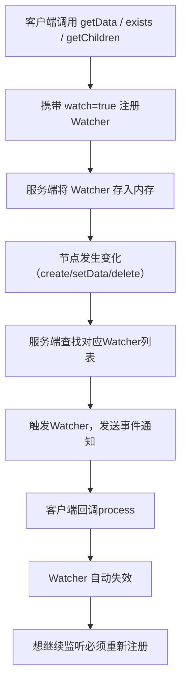

# 第十一篇｜ZK 3.7 Watcher 机制：注册、触发、通知全流程源码解析
大家好，上一篇我们把 ZK **Session、心跳、超时、分桶**彻底讲透。这一篇进入 ZK **事件驱动的灵魂**：
**Watcher 机制**。

几乎所有 ZK 核心场景：分布式锁、配置中心、服务发现、集群感知，全靠 Watcher 实现。
这一篇我从**源码 + 流程 + 面试 + 生产问题**一次性讲全，让你彻底搞懂：
Watcher 为什么是一次性的？为什么高性能？为什么会丢事件？

---

## 一、先搞懂：Watcher 到底是什么？
一句话定义：
**Watcher = 客户端在 ZK 上注册的“事件回调”**
当节点发生变化（创建、删除、数据变更、子节点变更），服务端会**一次性通知**客户端。

### Watcher 三大铁律（面试必考）
1. **一次性触发**：触发一次就失效，想继续监听必须重新注册
2. **串行通知**：服务端按顺序发送，不并发，保证顺序
3. **轻量级**：只通知“事件类型”，不携带完整数据，减少网络开销

---

## 二、Watcher 完整工作流程（极简架构图）


---

## 三、核心类与数据结构（源码灵魂）
ZK 在服务端用两个**超级精简**的集合管理所有 Watcher：

### 1. 服务端核心类
`org.apache.zookeeper.server.ZKDatabase`
`org.apache.zookeeper.server.DataTree`

### 2. 两大关键 Map（必须记住）
```java
// 1. 路径 → 哪些 Watcher 在监听它
private final HashMap<String, Set<Watcher>> watchTable = new HashMap<>();

// 2. Watcher → 它监听了哪些路径
private final HashMap<Watcher, Set<String>> watch2Paths = new HashMap<>();
```

- **watchTable**：找节点变化时，快速查谁在监听
- **watch2Paths**：会话过期时，快速清理该客户端所有 Watcher

这就是 ZK 支持**百万 Watcher 还不卡**的原因。

---

## 四、源码流程 1：Watcher 注册（客户端 → 服务端）
以 `getData(path, watch=true)` 为例：

### 客户端
- 发送请求时带上 `watch=true`
- 将自己的 `Watcher` 注册到本地管理器

### 服务端（DataTree）
```java
public void addWatch(String path, Watcher watcher) {
    // 1. 路径 → watcher
    watchTable.computeIfAbsent(path, k -> new HashSet<>()).add(watcher);

    // 2. watcher → 路径
    watch2Paths.computeIfAbsent(watcher, k -> new HashSet<>()).add(path);
}
```

**非常轻量，就是往两个 Map 里塞数据。**

---

## 五、源码流程 2：事件触发（节点变更）
当执行 `setData / create / delete` 时：
FinalRequestProcessor 会**主动触发 Watcher**：

```java
// 触发 Watcher 入口
dataTree.triggerWatch(path, eventType);
```

内部逻辑：

```java
public Set<Watcher> triggerWatch(String path, EventType type) {
    // 1. 取出该路径所有Watcher
    Set<Watcher> watchers = watchTable.remove(path);

    if (watchers == null) return emptySet;

    // 2. 从watch2Paths清理
    for (Watcher w : watchers) {
        Set<String> paths = watch2Paths.get(w);
        if (paths != null) paths.remove(path);
    }

    // 3. 逐个发送事件
    for (Watcher w : watchers) {
        w.process(new WatchedEvent(type, path));
    }

    return watchers;
}
```

### 你看到了吗？
**triggerWatch 一执行，watchTable 就 remove(path)**
这就是 **Watcher 一次性**的源码真相！

---

## 六、源码流程 3：服务端发送通知
服务端的 Watcher 实现类是：
`NIOServerCnxn`（网络连接）

发送逻辑：
- 只发送事件（路径、事件类型）
- **不发送节点数据**
- 客户端收到后，需要自己再 getData

这就是 Watcher **轻量、高性能**的关键。

---

## 七、源码流程 4：客户端接收与回调
客户端：
`ClientCnxn$EventThread`

1. 接收事件
2. 放入事件队列
3. 串行回调用户 `process(WatchedEvent)`

**串行：保证顺序，不并发，不乱序。**

---

## 八、面试高频题（直接背满分答案）
### 1）Watcher 为什么是一次性的？
源码里写死：
**triggerWatch 时直接 remove(path)**
触发即删除，必须重新注册。

### 2）为什么只发事件，不发数据？
- 减少网络包大小
- 避免大量客户端同时拉全量数据压垮服务端
- 让客户端按需拉取，压力可控

### 3）Watcher 会丢事件吗？
**可能会。**
- 触发与重新注册之间有空隙
- 这段时间内发生的变更，客户端感知不到
  这就是所谓的**“窗口期丢失”**。

### 4）会话过期，Watcher 会怎样？
服务端会通过 `watch2Paths`
**一次性清理该客户端所有 Watcher**
并触发 `None(-1)` 事件。

---

## 九、生产常见问题（直接对应源码）
### 1）Watcher 不触发
- 路径写错
- 已经触发过（一次性）
- 会话已过期
- 节点根本没变化

### 2）Watcher 重复触发
- 多次注册了同一个 Watcher
- 子节点变更 + 父节点监听同时触发

### 3）事件延迟
- EventThread 积压
- 客户端处理太慢
- 服务端 IO/CPU 高

### 4）大量 Watcher 导致内存飙升
- watchTable / watch2Paths 过大
- 客户端不清理，会话一直活着

---

## 十、写在最后
Watcher 是 ZK **事件驱动模型**的核心，
也是它能成为**注册中心、配置中心、分布式锁、队列、协调服务**的基础。

理解了：
- 一次性
- 轻量通知
- 双 Map 管理
- 串行触发

你就彻底吃透了 ZK Watcher 源码。

---

# 下一篇：第十二篇
# 第十二篇｜ZK 3.7 临时节点（Ephemeral Node）原理与源码解析
内容包括：
- 临时节点为什么不能有子节点？
- 临时节点存在哪里？内存还是磁盘？
- 会话超时如何自动删除临时节点？
- 临时节点与分布式锁安全机制
- 生产常见问题：节点不删、重复、丢失

你要我现在直接写 **第十二篇（可直接发CSDN）** 吗？