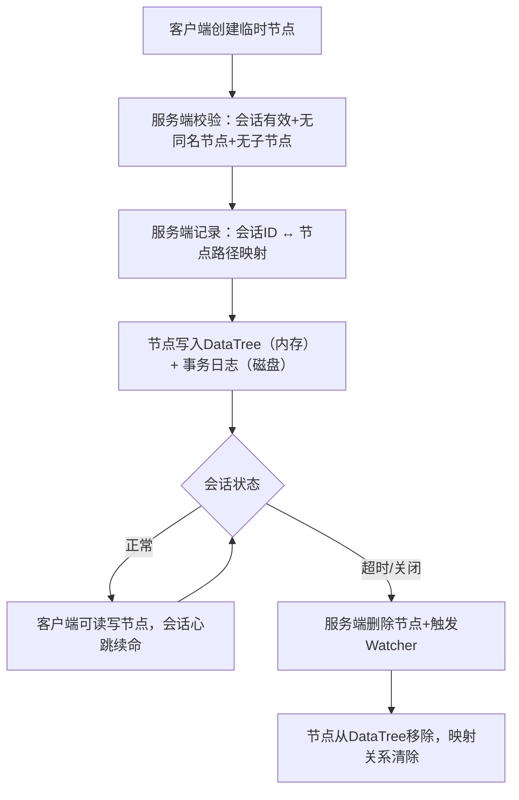

# 第十二篇｜ZK 3.7 临时节点（Ephemeral Node）原理与源码解析
大家好，上一篇我们把 ZK Watcher 机制的注册、触发、一次性原理彻底讲透。这一篇聚焦 ZK 最核心的功能之一——**临时节点（Ephemeral Node）**。

临时节点是 ZK 实现**分布式锁、服务注册发现、集群节点存活检测**的核心基石。这一篇我从源码层面，讲清楚临时节点的创建、存储、自动删除逻辑，以及生产中“临时节点删不掉、重复创建、丢失”等问题的根源和排查方法。

---

## 一、先搞懂：临时节点的核心特性（面试必背）
临时节点（Ephemeral Node）是与**会话（Session）强绑定**的节点，核心特性总结为 5 条铁律：
1. **会话绑定**：节点生命周期 = 会话生命周期，会话失效则节点自动删除；
2. **无子节点**：临时节点不能创建子节点（源码强制限制）；
3. **内存优先**：元数据持久化到磁盘，但“会话-节点”映射只存内存；
4. **不可修改类型**：创建后不能从临时节点改为持久节点，反之亦然；
5. **唯一性**：同一路径下，临时节点与持久节点互斥（不能重复创建）。

### 临时节点的两种类型
| 类型 | 标识 | 特点 |
|------|------|------|
| 普通临时节点 | CreateMode.EPHEMERAL | 会话失效即删除 |
| 临时顺序节点 | CreateMode.EPHEMERAL_SEQUENTIAL | 会话失效即删除，自动追加递增序号 |

---

## 二、临时节点的整体工作流程


---

## 三、核心源码解析 1：临时节点的创建（强制约束）
临时节点的创建逻辑集中在 `PrepRequestProcessor`（前置请求处理器），源码位置：`org.apache.zookeeper.server.PrepRequestProcessor`

### 核心校验逻辑（创建时的 3 道关卡）
```java
private void createRequest(Request request) throws KeeperException {
    String path = request.getPath();
    CreateMode mode = request.getCreateMode();
    long sessionId = request.getSessionId();

    // 关卡1：临时节点必须绑定有效会话（sessionId不能为0）
    if (mode.isEphemeral() && sessionId == 0) {
        throw new KeeperException.InvalidACLException("Ephemeral node requires valid session");
    }

    // 关卡2：临时节点不能有子节点（父节点是临时节点则拒绝）
    if (dataTree.exists(path.substring(0, path.lastIndexOf('/'))) != null 
        && dataTree.getNode(path.substring(0, path.lastIndexOf('/'))).isEphemeral()) {
        throw new KeeperException.NoChildrenForEphemeralsException("Ephemeral node cannot have children");
    }

    // 关卡3：路径不能已存在（临时/持久节点互斥）
    if (dataTree.exists(path) != null) {
        throw new KeeperException.NodeExistsException("Node " + path + " already exists");
    }

    // 核心：记录会话-临时节点映射
    if (mode.isEphemeral()) {
        dataTree.addEphemeralNode(path, sessionId);
    }

    // 写入内存DataTree + 事务日志
    dataTree.createNode(path, request.getData(), request.getAcl(), mode);
}
```

### 关键解读：
1. **会话绑定校验**：临时节点必须归属一个有效会话，无会话（sessionId=0）直接抛异常；
2. **无子节点约束**：源码直接校验父节点是否为临时节点，是则拒绝创建，这是 ZK 设计层面的强制限制（避免临时节点层级过深，会话失效后删除逻辑复杂）；
3. **映射记录**：`addEphemeralNode` 会在 `DataTree` 中记录 `sessionId → 节点路径` 的映射，这是后续自动删除的核心依据。

---

## 四、核心源码解析 2：临时节点的存储机制
临时节点的存储分为“内存映射”和“持久化日志”两部分，缺一不可：

### 1. 内存映射（会话-节点映射）
`DataTree` 中维护临时节点的核心结构：
```java
// key：sessionId，value：该会话创建的所有临时节点路径
private final ConcurrentHashMap<Long, HashSet<String>> ephemerals = new ConcurrentHashMap<>();

// 添加临时节点映射
public void addEphemeralNode(String path, long sessionId) {
    ephemerals.computeIfAbsent(sessionId, k -> new HashSet<>()).add(path);
}

// 获取会话的所有临时节点
public Set<String> getEphemerals(long sessionId) {
    return ephemerals.getOrDefault(sessionId, Collections.emptySet());
}
```

**关键**：这个映射只存在内存中，不会持久化到磁盘——因为会话是动态的，持久化无意义，会话失效后直接清理即可。

### 2. 持久化存储（事务日志）
临时节点的元数据（路径、数据、ACL、类型）会写入事务日志（FileTxnLog），源码在 `SyncRequestProcessor`：
```java
// 写请求刷盘时，临时节点与持久节点一样写入日志
public void processRequest(Request request) {
    if (Request.isValidTxn(request.getType())) {
        // 写入事务日志，包含节点类型（EPHEMERAL）
        zkServer.getTxnLogFactory().append(request.getHdr(), request.getTxn());
    }
}
```

**关键解读**：
- 临时节点的元数据持久化到磁盘，保证服务端重启后能恢复节点信息；
- 重启后，服务端会根据“存活的会话”筛选临时节点：只有会话仍有效，临时节点才会被恢复；会话失效的临时节点，重启后直接删除。

---

## 五、核心源码解析 3：临时节点的自动删除（会话失效触发）
临时节点的自动删除是 ZK 最核心的特性，触发时机有两个：**会话超时**、**客户端主动关闭会话**，核心逻辑在 `SessionTrackerImpl` 的 `expire` 方法：

```java
private void expire(long sessionId) {
    // 1. 标记会话失效
    sessions.remove(sessionId);
    
    // 2. 获取该会话的所有临时节点
    Set<String> ephemeralPaths = dataTree.getEphemerals(sessionId);
    if (ephemeralPaths.isEmpty()) {
        return;
    }
    
    // 3. 批量删除临时节点（核心）
    for (String path : ephemeralPaths) {
        try {
            // 删除节点，触发Watcher
            dataTree.deleteNode(path, -1);
            LOG.info("Deleted ephemeral node " + path + " for session " + sessionId);
        } catch (KeeperException e) {
            LOG.error("Failed to delete ephemeral node " + path, e);
        }
    }
    
    // 4. 清理会话-节点映射
    dataTree.removeEphemeralNodes(sessionId);
}
```

### 关键解读：
1. **删除时机**：会话超时/关闭后，`SessionExpiryThread` 线程调用 `expire` 方法，批量删除临时节点；
2. **Watcher 触发**：删除节点时会触发 `NodeDeleted` 事件，这是分布式锁“释放锁”的核心逻辑；
3. **映射清理**：删除节点后，从 `ephemerals` 中移除该会话的映射，避免内存泄漏。

---

## 六、面试高频题（源码级标准答案）
### 问题 1：临时节点为什么不能有子节点？
答：核心是为了简化会话失效后的删除逻辑。如果临时节点允许有子节点，会话失效时需要递归删除所有子节点，会增加服务端开销，且容易出现删除不彻底的问题。源码中 `PrepRequestProcessor` 创建节点时，会强制校验父节点是否为临时节点，若是则抛 `NoChildrenForEphemeralsException`。

### 问题 2：临时节点存储在内存还是磁盘？
答：两者都有。
- 「会话-节点映射」只存内存（`DataTree.ephemerals`），会话失效后直接清理；
- 「节点元数据」（路径、数据、类型）持久化到磁盘事务日志，服务端重启后可恢复；
- 重启后，只有会话仍有效的临时节点会被恢复，会话失效的则直接删除。

### 问题 3：临时节点会话超时后，为什么有时候删不掉？
答：常见原因：
1. 服务端 `SessionExpiryThread` 线程被阻塞（CPU/IO 高），未及时执行 `expire` 方法；
2. 集群脑裂，旧 Leader 未感知会话失效，临时节点未删除；
3. 事务日志损坏，服务端重启后无法识别临时节点归属的会话。

### 问题 4：临时节点实现分布式锁的核心原理是什么？
答：1. 客户端创建指定路径的临时节点，创建成功则获取锁；2. 创建失败则注册 Watcher 监听该节点；3. 持有锁的客户端会话失效，临时节点自动删除；4. 其他客户端收到 `NodeDeleted` 事件，重新尝试创建节点抢锁。

---

## 七、生产常见问题与排查方法
| 问题现象 | 常见原因 | 排查方向 |
|----------|----------|----------|
| 临时节点会话超时后未删除 | 1. SessionExpiryThread 阻塞；2. 集群节点状态异常；3. 事务日志损坏 | 1. 查看服务端日志，关键词“Failed to delete ephemeral node”；2. 检查节点 CPU/IO 使用率；3. 校验事务日志完整性 |
| 重复创建相同路径的临时节点 | 1. 客户端多线程并发创建；2. 集群数据同步延迟；3. 旧会话未清理导致节点残留 | 1. 客户端加分布式锁控制创建逻辑；2. 检查集群同步状态（`echo mntr | nc 127.0.0.1 2181`）；3. 手动清理残留节点 |
| 临时节点丢失 | 1. 客户端会话超时；2. 网络抖动导致心跳中断；3. Leader 切换导致节点未同步 | 1. 查看客户端日志，关键词“Session expired”；2. 优化网络，调整心跳间隔（sessionTimeout/3）；3. 保证集群过半节点存活 |
| 临时节点创建失败，提示“NodeExists” | 1. 路径已存在同名节点；2. 旧会话残留节点未删除；3. 集群数据不一致 | 1. 检查节点是否存在（`ls /path`）；2. 重启异常节点，触发数据清理；3. 手动删除残留节点 |

---

## 八、生产调优建议（基于源码）
1. **控制临时节点数量**：每个会话创建的临时节点不宜过多（建议≤1000），避免 `DataTree.ephemerals` 过大导致内存飙升；
2. **合理设置 sessionTimeout**：建议 30s~60s，过短易导致节点误删，过长则锁释放延迟；
3. **监控 SessionExpiryThread**：通过 ZK 监控指标（`zk_session_expired_count`）监控会话过期频率，及时发现异常；
4. **避免临时节点路径过长**：路径过长会增加事务日志存储开销，且删除时效率降低。

---

## 九、写在最后
临时节点是 ZK 分布式能力的核心体现，其“会话绑定、自动删除、轻量高效”的特性，使其成为分布式锁、服务注册发现、存活检测的首选方案。理解了临时节点的创建约束、存储机制、自动删除逻辑，你就能解决 90% 以上的 ZK 生产问题。

下一篇我们会聚焦 ZK 的**权限控制（ACL）机制**，解析 ZK 如何通过 ACL 保证节点的访问安全，以及生产中常见的权限配置错误和排查方法。

### CSDN专属标签
#ZooKeeper3.7 #临时节点 #Ephemeral Node #分布式锁 #会话绑定 #中间件源码 #ZK生产问题

---

### 小预告
下一篇内容：《第十三篇｜ZK 3.7 ACL 权限控制：原理、配置与源码解析》，会重点讲解 ACL 的权限类型、鉴权流程、源码实现，以及生产中权限配置错误的排查方法，提前可以先在 IDEA 中打开 `ACL`、`Id` 类熟悉一下~