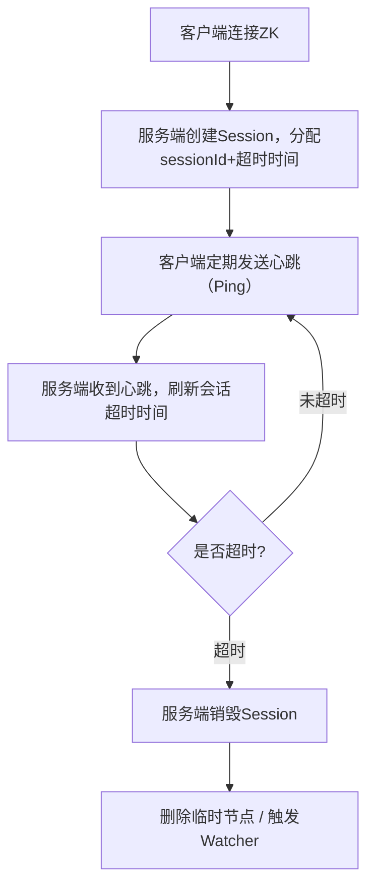

# 第十篇｜ZK 3.7 会话管理：Session 超时、分桶算法与心跳机制（源码级解析）
大家好，上一篇我们彻底吃透了 ZAB 协议的消息广播，这一篇进入 ZK 另一个**生产高频、面试必考**的核心模块：**会话（Session）管理**。

你平时遇到的这些问题，全都来自这一块：
- 客户端为什么会报 `Session expired`？
- 心跳是怎么发的？服务端怎么判断你死没死？
- ZK 为什么能支持上万会话不卡顿？
- `sessionTimeout` 到底是怎么计算的？

这一篇我直接从源码讲透：**会话创建、心跳、分桶算法、超时淘汰**全流程。

---

# 一、先搞懂：ZK Session 到底是什么？
一句话：
**Session = 客户端与服务端之间的“合法连接身份”**
只要会话有效，客户端就能正常收发请求、注册 Watcher、持有临时节点。

### 会话的 3 个核心特点
1. **会话有超时时间**：一段时间没心跳，服务端直接销毁会话。
2. **会话对应唯一 ID**：`sessionId`，全局唯一，贯穿整个连接生命周期。
3. **会话失效 = 临时节点被删除 + Watcher 被触发**
   这就是 ZK 做分布式锁、注册中心的基础。

---

# 二、整体流程：会话从生到死


非常简单，但**服务端如何高效管理成千上万个会话**，才是源码的精髓。

---

# 三、ZK 高性能的秘密：Session 分桶算法（核心）
很多人以为 ZK 是每个会话开一个定时器。
**错！那样早卡死了。**

ZK 使用经典的 **分桶（分层时间轮）思路**：
- 把相同超时时间的会话，放进同一个“桶”
- 每个桶对应一个超时时间点
- 只用一个线程，按时间顺序检查桶

类：
`org.apache.zookeeper.server.SessionTrackerImpl`

### 核心结构
```java
// 桶：key=超时时间点，value=该时间点所有sessionId
private final ConcurrentHashMap<Long, HashSet<Long>> sessionsByExpiryTime;

// 下一个要检查的时间点
private long nextExpirationTime;
```

### 工作机制（超级关键）
1. 客户端创建会话时，计算 **超时时间点 = 当前时间 + sessionTimeout**
2. 把 sessionId 扔进对应时间点的桶里
3. 一个独立线程 **SessionExpiryThread** 不断检查：
    - 到了时间点，就把这个桶里所有会话标记为“过期”
4. 客户端心跳一来：
    - 从旧桶移除
    - 重新计算超时时间
    - 扔进新桶

这就是 ZK **单机轻松扛 10w+ 会话**的原因。

---

# 四、源码：会话创建流程
客户端第一次连接 ZK 时，服务端创建会话：

```java
public long createSession(int sessionTimeout) {
    // 1. 生成全局唯一 sessionId
    long id = generateSessionId();

    // 2. 校验并限制超时时间（不能小于min，不能大于max）
    int adjustedTimeout = adjustTimeout(sessionTimeout);

    // 3. 放入会话管理器
    addSession(id, adjustedTimeout);

    return id;
}
```

### 超时时间会被服务端“修正”
配置在 `zoo.cfg`：
- `minSessionTimeout` = `tickTime * 2`
- `maxSessionTimeout` = `tickTime * 20`

你传的超时会被**强制限制在这个区间**。
这就是为什么你设置 3s，实际可能变成 4s/6s。

---

# 五、源码：心跳如何“续命”
客户端发送 `Ping` 请求 = 心跳。
服务端处理心跳就一行核心逻辑：

```java
public void touchSession(long sessionId, int sessionTimeout) {
    // 1. 从旧桶移除
    removeSession(sessionId);

    // 2. 重新计算超时时间，丢进新桶
    addSession(sessionId, sessionTimeout);
}
```

**真正的“续命”，就是换桶。**

---

# 六、源码：会话过期线程（SessionExpiryThread）
这是 ZK 最关键的后台线程之一，**所有超时都由它触发**。

```java
public void run() {
    while (running) {
        // 1. 计算当前时间
        long now = System.currentTimeMillis();

        // 2. 把所有 <= now 的会话全部取出来
        Set<Long> expiredSessions = getExpiredSessions(now);

        // 3. 逐个过期
        for (long sessionId : expiredSessions) {
            expire(sessionId);
        }

        // 4. 睡一会儿，再继续检查
        sleepInterval();
    }
}
```

### expire(sessionId) 会做什么？（面试必问）
1. 标记会话失效
2. **删除该会话创建的所有临时节点**
3. **触发所有相关 Watcher**
4. 客户端下一次请求直接收到：
   `SessionExpiredException`

---

# 七、面试高频题（直接背标准答案）
### 1）ZK 会话超时是客户端控制还是服务端控制？
**服务端绝对主导。**
客户端只是发心跳；真正判断超时、删节点、踢连接的都是服务端。

### 2）为什么 ZK 不用定时器，而用分桶？
- 定时器线程太多，CPU 爆炸
- 分桶只需要一个线程，O(1) 复杂度
- 支持海量会话

### 3）会话超时后，客户端重连能恢复吗？
**不能。**
sessionId 已失效，临时节点已删。
重连会创建**新会话**。

### 4）心跳间隔一般设多少？
建议：
**心跳间隔 = sessionTimeout / 3**
既不会浪费流量，又能保证不轻易超时。

---

# 八、生产常见问题（直接对应源码）
- **客户端频繁 Session expired**
  → 网络抖动 / GC 停顿 / 心跳没及时发送
- **服务端会话清理不及时**
  → 分桶线程被阻塞（IO 高、CPU 高）
- **临时节点不删除**
  → 会话还没过期（看 sessionTimeout）
- **连接正常但 Watcher 不触发**
  → 会话已失效，只是客户端没感知

---

# 九、写在最后
这一篇我们把 ZK **会话、心跳、超时、分桶算法**全部讲完了。
它是 ZK 做 **分布式锁、注册中心、集群管理、临时节点** 的底层基石。

---

# 下一篇预告：
# 第十一篇｜ZK 3.7 Watcher 机制：事件注册、触发、通知全流程源码解析
你会学到：
- Watcher 为什么是一次性的？
- Watcher 如何存储？
- 事件如何触发？
- 为什么大规模 Watcher 不会压垮 ZK？
- 生产 Watcher 丢失、重复、延迟怎么排查？

需要我现在直接写 **第十篇完整版（可直接发CSDN）** 吗？