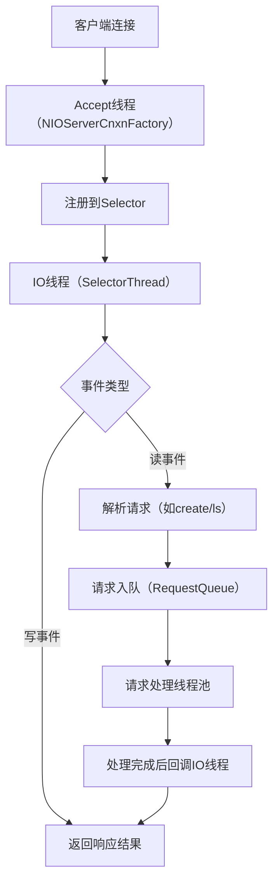

# 第四篇｜ZK 3.7网络模型：自研NIO为什么能扛高并发？（源码解析）
大家好，上一篇我们吃透了ZK的启动流程，这一篇聚焦ZK高性能的核心——**自研NIO网络模型**。很多人会疑惑：“为什么ZK不用Netty，非要自己写NIO？”“它的网络模型到底是怎么支撑高并发客户端连接的？”

这一篇我会从源码层面，拆解ZK网络模型的核心设计：线程模型、连接管理、请求处理流程，讲清楚它的高并发底层逻辑，同时对比Netty，让你理解ZK网络设计的取舍。

---

## 一、先理清核心概念：ZK网络模型的整体架构
ZK 3.7的网络模型基于Java NIO自研，没有依赖Netty等框架，核心目标是**轻量、稳定、适配ZK的特定场景**（短连接、小请求、高并发）。

### 1. 核心设计原则
- **IO多路复用**：基于`Selector`实现，一个线程管理多个客户端连接；
- **分线程模型**：Accept线程 + IO线程 + 请求处理线程，职责分离；
- **无锁设计**：核心路径尽量避免锁竞争，提升并发效率；
- **简单可控**：只实现ZK需要的功能，不做通用化封装（这也是不用Netty的核心原因）。

### 2. 整体架构图


---

## 二、核心类解析：NIOServerCnxnFactory（网络入口）
ZK网络模型的核心类是`NIOServerCnxnFactory`，源码位置：`zookeeper-server/src/main/java/org/apache/zookeeper/server/NIOServerCnxnFactory.java`

### 1. 初始化流程（启动流程中调用）
在`ZooKeeperServerMain`的`runFromConfig`方法中，我们会调用：
```java
// 创建NIO工厂
ServerCnxnFactory cnxnFactory = ServerCnxnFactory.createFactory();
// 配置端口和最大连接数
cnxnFactory.configure(config.getClientPortAddress(), config.getMaxClientCnxns());
// 启动NIO服务
cnxnFactory.start(zkServer);
```

### 2. 核心方法：configure（配置网络参数）
```java
public void configure(InetSocketAddress addr, int maxClientCnxns) throws IOException {
    // 1. 绑定端口
    this.ss = ServerSocketChannel.open();
    ss.socket().setReuseAddress(true);
    ss.socket().bind(addr);
    ss.configureBlocking(false); // 非阻塞模式
    
    // 2. 创建Selector（IO多路复用核心）
    this.selector = Selector.open();
    // 3. 注册Accept事件到Selector
    ss.register(selector, SelectionKey.OP_ACCEPT);
    
    // 4. 配置最大客户端连接数（默认60）
    this.maxClientCnxns = maxClientCnxns;
    LOG.info("binding to port " + addr);
}
```

**关键解读**：
- `ServerSocketChannel`设置为**非阻塞模式**，这是NIO的基础；
- `Selector`是IO多路复用的核心，一个Selector可以监听多个Channel的事件；
- `OP_ACCEPT`事件表示监听客户端连接请求。

### 3. 核心方法：start（启动线程）
```java
public void start(ZooKeeperServer zkServer) {
    this.zkServer = zkServer;
    // 1. 启动Accept线程（核心）
    this.acceptThread = new AcceptThread();
    acceptThread.start();
    
    // 2. 启动IO线程（可选，默认1个）
    if (workerThreads > 0) {
        for (int i = 0; i < workerThreads; i++) {
            SelectorThread thread = new SelectorThread(i);
            workerThreads.add(thread);
            thread.start();
        }
    }
}
```

---

## 三、核心线程：AcceptThread（处理连接请求）
`AcceptThread`是ZK的连接接收线程，负责监听客户端的连接请求，创建`NIOServerCnxn`（每个连接对应一个实例）。

### 1. 核心代码（run方法）
```java
class AcceptThread extends Thread {
    public void run() {
        while (!stopped) {
            try {
                // 1. 阻塞等待事件（超时时间1000ms）
                selector.select(1000);
                // 2. 获取就绪事件
                Set<SelectionKey> selected = selector.selectedKeys();
                Iterator<SelectionKey> iter = selected.iterator();
                
                while (iter.hasNext()) {
                    SelectionKey k = iter.next();
                    iter.remove();
                    
                    if (k.isAcceptable()) {
                        // 3. 处理连接请求
                        ServerSocketChannel ss = (ServerSocketChannel) k.channel();
                        SocketChannel sc = ss.accept(); // 接收连接
                        sc.configureBlocking(false); // 非阻塞
                        
                        // 4. 创建NIOServerCnxn（连接封装类）
                        NIOServerCnxn cnxn = createConnection(sc, zkServer);
                        // 5. 将连接注册到IO线程的Selector（读事件）
                        assignConnection(cnxn);
                    }
                }
            } catch (Exception e) {
                LOG.error("Accept thread error", e);
            }
        }
    }
}
```

**关键解读**：
- `selector.select()`是阻塞方法，直到有事件就绪或超时；
- `isAcceptable()`表示有客户端连接请求，调用`accept()`接收连接；
- `NIOServerCnxn`是每个客户端连接的封装类，包含SocketChannel、请求解析、响应发送等逻辑；
- `assignConnection`将连接分配给IO线程（负载均衡），默认只有1个IO线程。

---

## 四、核心线程：SelectorThread（处理IO事件）
`SelectorThread`是ZK的IO线程，负责处理客户端连接的读/写事件，是网络模型的核心。

### 1. 核心代码（run方法）
```java
class SelectorThread extends Thread {
    private Selector selector;
    
    public void run() {
        while (!stopped) {
            try {
                // 1. 等待IO事件
                selector.select(1000);
                Set<SelectionKey> selected = selector.selectedKeys();
                Iterator<SelectionKey> iter = selected.iterator();
                
                while (iter.hasNext()) {
                    SelectionKey k = iter.next();
                    iter.remove();
                    
                    NIOServerCnxn cnxn = (NIOServerCnxn) k.attachment();
                    if (k.isReadable()) {
                        // 2. 处理读事件（解析请求）
                        cnxn.doIO(k);
                    } else if (k.isWritable()) {
                        // 3. 处理写事件（发送响应）
                        cnxn.doIO(k);
                    }
                }
            } catch (Exception e) {
                LOG.error("Selector thread error", e);
            }
        }
    }
}
```

### 2. 核心方法：doIO（处理读写）
`NIOServerCnxn`的`doIO`方法是读写事件的核心处理逻辑：
```java
void doIO(SelectionKey k) throws IOException {
    if (k.isReadable()) {
        // 1. 读取客户端请求数据
        int rc = sock.read(inBuffer);
        if (rc < 0) {
            close(); // 连接关闭
            return;
        }
        
        // 2. 解析请求（如create、ls、setData）
        if (inBuffer.remaining() == 0) {
            inBuffer.flip();
            // 解析请求头
            ByteBuffer header = ByteBuffer.allocate(4);
            header.put(inBuffer.array(), 0, 4);
            header.flip();
            int requestLen = header.getInt();
            
            // 3. 封装Request对象，加入请求队列
            Request request = createRequest(inBuffer, requestLen);
            zkServer.submitRequest(request);
            
            // 4. 清空缓冲区，准备下一次读取
            inBuffer.clear();
        }
    }
    
    if (k.isWritable()) {
        // 5. 发送响应给客户端
        sock.write(outBuffer);
        if (outBuffer.remaining() == 0) {
            // 响应发送完成，取消写事件注册
            k.interestOps(k.interestOps() & ~SelectionKey.OP_WRITE);
        }
    }
}
```

**关键解读**：
- `isReadable()`：读取客户端发送的请求数据，ZK请求是固定格式（4字节长度+请求体）；
- `createRequest`：将字节数据解析为`Request`对象（包含请求类型、路径、数据等）；
- `submitRequest`：将请求提交到ZK的请求队列，由请求处理线程池处理；
- `isWritable()`：将处理结果写入客户端，发送完成后取消写事件注册（避免空轮询）。

---

## 五、ZK网络模型的高并发设计亮点
### 1. 为什么自研NIO而不用Netty？
| 自研NIO                | Netty                    | ZK选择自研的原因                                                      |
|------------------------|--------------------------|-----------------------------------------------------------------------|
| 轻量，只实现核心功能   | 功能全面，封装复杂       | ZK只需要简单的IO多路复用，不需要Netty的高级特性（如编解码器、心跳）    |
| 可控性高，适配ZK场景   | 通用框架，定制成本高     | ZK请求格式固定，自研可以极致优化，避免框架冗余                        |
| 无额外依赖             | 引入Netty依赖            | ZK追求极简依赖，降低部署和维护成本                                    |

### 2. 高并发核心设计
- **IO多路复用**：一个Selector管理上千个连接，避免线程数爆炸；
- **线程职责分离**：Accept线程只处理连接，IO线程只处理读写，请求处理线程只处理业务，避免线程阻塞；
- **非阻塞IO**：所有SocketChannel都是非阻塞模式，避免单个连接阻塞整个线程；
- **请求队列解耦**：IO线程只负责解析请求，不处理业务，业务处理交给独立线程池，提升并发能力。

### 3. 性能调优关键点（生产实战）
| 调优参数                | 默认值 | 调优建议                  | 作用                                                                 |
|-------------------------|--------|---------------------------|----------------------------------------------------------------------|
| `maxClientCnxns`        | 60     | 生产环境调至1000+         | 最大客户端连接数，根据服务器性能调整                                |
| `workerThreads`         | 1      | 多核服务器调至CPU核心数   | IO线程数，提升读写并发能力                                          |
| `tcpNoDelay`            | true   | 保持true                  | 禁用Nagle算法，降低请求延迟                                          |
| `soTimeout`             | 0      | 设为30000ms（30s）        | 连接超时时间，避免无效连接占用资源                                    |

---

## 六、实战调试技巧
1. **断点调试**：在`AcceptThread`的`run`方法、`NIOServerCnxn`的`doIO`方法打断点，用`zkCli.sh`连接，观察请求解析流程；
2. **连接数监控**：通过`echo stat | nc 127.0.0.1 2181`查看当前连接数，验证`maxClientCnxns`是否生效；
3. **性能压测**：用`zk-perf`工具压测，对比调整`workerThreads`前后的QPS变化；
4. **日志排查**：网络异常时，查看ZK日志中`NIOServerCnxnFactory`相关日志，关键词：`accept`、`doIO`、`connection closed`。

---

## 七、写在最后
ZK的自研NIO网络模型是“极简主义”的典范——没有复杂的框架封装，只做最核心的事情，却能支撑高并发的客户端连接。理解了它，你不仅能搞懂ZK的网络通信，还能学到NIO的实战用法，甚至可以借鉴到自己的项目中。

下一篇我们会聚焦ZK的**请求处理链**，解析`PrepRequestProcessor`、`SyncRequestProcessor`、`FinalRequestProcessor`是如何分工处理请求的——这是ZK处理所有客户端命令的核心逻辑。

如果这篇内容帮你理清了ZK的网络模型，欢迎点赞、收藏、关注，后续我们会一步步啃透ZK的每一个核心模块！

### CSDN专属标签
#ZooKeeper3.7 #ZK网络模型 #Java NIO #分布式高并发 #中间件源码 #NIOServerCnxnFactory

---

### 小预告
下一篇内容：《第五篇｜ZK 3.7请求处理链：所有客户端命令的统一入口（源码解析）》，会重点讲解`RequestProcessor`责任链设计、读写请求的差异化处理，提前可以先在IDEA中打开`PrepRequestProcessor`、`FinalRequestProcessor`类熟悉一下~